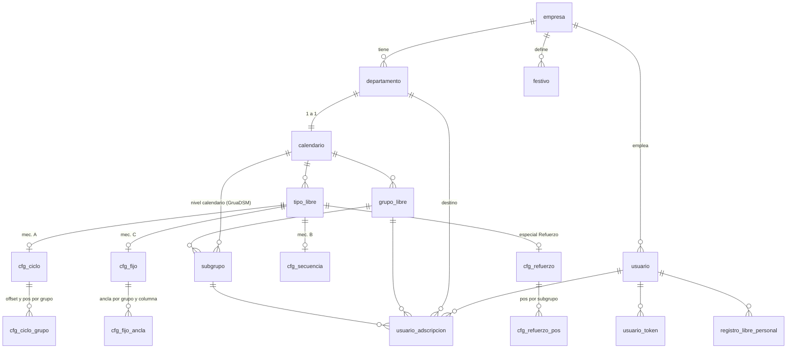

# Diseño de base de datos — Sistema de calendarios y libres

> **Cómo leer este documento**: los **§1–§7** son el **histórico de trabajo** (primer
> diseño + auditoría) y se conservan como registro de decisiones — varias entidades y
> decisiones están **sustituidas** y llevan su nota indicándolo. El **diseño definitivo**
> está en los **§8 (capa de configuración del motor)** y **§9 (capa de dominio/usuario)**.
> El **§10** es el tablero vivo de la revisión.

## 0. Para el implementador — resumen ejecutivo

**Stack destino**: Fastify + **Prisma** + **TypeScript** sobre **PostgreSQL**. El motor
de cálculo es `motor-calendarios/` (JavaScript vanilla, ES modules, sin dependencias) y
se **importa tal cual** desde TypeScript — **no se reescribe** (está validado contra
calendarios impresos; LOGICA §8.7).

**Orden de lectura recomendado**: (1) `LOGICA_CALENDARIOS.md` completo — el *qué*: cómo
funciona el cálculo y el dominio; (2) este documento, **§0 + §8 + §9** — el *cómo*:
esquema y flujos. Los §1–§7 solo como histórico.

### Qué VA en base de datos

1. **Estructura**: `empresa`, `departamento`, `calendario` (1:1 con departamento, flag
   `publico`), `grupo_libre`, `subgrupo`, `tipo_libre` (§8.1).
2. **Configuración del motor** — los *datos base* que las funciones necesitan: fechas
   ancla, arrays `libres`/`trabajo`, `total_secuencia` (se guarda, **no se recalcula**),
   offsets y `pos` por grupo, secuencias de saltos, mapas día→pos, pasos fijos
   (tablas `cfg_*`, §8.1–8.3).
3. **Dominio**: `usuario`, `usuario_token`, `usuario_adscripcion` (histórico inmutable),
   `registro_libre_personal`, `festivo` (§9).

### Qué NO va en base de datos

1. **Las fechas calculadas**: jamás se materializan — todo se calcula al vuelo con el
   motor (la única excepción permitida es una **caché** opcional e invalidable, que
   nunca es fuente de verdad).
2. **La lógica de cálculo**: vive en código (`motor-calendarios/` + las funciones que
   leen `cfg_*`); en BD solo hay **parámetros**. Lógica nueva = código nuevo + ampliar
   el enum `funcion_calculo` por migración (§8.1, invariante 3 del esqueleto).
3. **El calendario del usuario**: se compone al vuelo — genérico por tramos de
   adscripción + registros personales + festivos (§9.7).
4. **Saldos derivables**: el cupo de vacaciones se cuenta al vuelo desde los registros
   (sin tabla de saldo, §9.4).

### Notas Prisma/TypeScript (críticas — leer antes de crear el esquema)

1. **`EXCLUDE USING gist`, los `CHECK` y los índices parciales NO se pueden declarar en
   `schema.prisma`**: hay que añadirlos **a mano en el SQL de la migración**
   (`prisma migrate dev --create-only` y editar antes de aplicar). Sin los `EXCLUDE`
   desaparecen los anti-solapes de adscripciones y registros — **no saltárselos**.
   Igual con `CREATE EXTENSION btree_gist`.
2. **Columnas `DATE` (`@db.Date`)**: Prisma las lee como `Date` JS a **medianoche UTC**
   y, al escribir, una fecha construida a medianoche **local** (`new Date(y, m, d)`) se
   serializa en UTC y **puede retroceder un día** en España. Es la misma trampa de zona
   horaria de LOGICA §8.6.1. Recomendación: tratar las fechas civiles como **strings
   `"YYYY-MM-DD"`** en la capa de API/servicios y convertir explícitamente solo en la
   frontera con el motor (que trabaja con `Date` en hora local).
3. **El motor es ESM JavaScript**: importable desde TS (`allowJs` o como paquete
   workspace). Tipos: basta un `.d.ts` fino con las firmas de `index.js`.
4. **Enums**: en el DDL de este documento son `TEXT + CHECK`; en Prisma pueden mapearse
   como `enum` de Prisma o `String` — cualquiera vale, pero mantener los **mismos
   literales** que aquí.
5. Los `BIGINT GENERATED ALWAYS AS IDENTITY` equivalen a `BigInt @id @default(autoincrement())`
   con `@db.BigInt`; los `JSONB` a `Json`.

---

## 1. Glosario (vocabulario fijo)

- **Departamento**: unidad organizativa. Un usuario pertenece a uno solo a la vez.
- **TipoLibre**: categoría de día libre (festivo, vacación, día de reducción, subgrupo, sábado libre, etc.). Puede ser de ámbito sistema o de ámbito departamento.
- **GrupoLibre**: agrupación de libres dentro de un departamento. Un departamento puede tener 1 o varios grupos. Las fechas varían entre grupos del mismo departamento.
- ~~**FechaReferencia**~~ *(eliminada del diseño definitivo, §9.5)*: las anclas de cálculo viven en la config del motor (§8) y los festivos tienen tabla propia.
- **CalendarioDepartamento**: plantilla anual de fechas de referencia. Asociada a (departamento, grupo, año).
- **Adscripción**: pertenencia de un usuario a (departamento, grupo, subgrupo) durante un intervalo de tiempo. Tiene histórico.
- **RegistroLibreUsuario**: día o rango registrado por el propio usuario (vacaciones, día pedido a empresa, cambio con compañero, falta). Es la única información del usuario sobre libres que se persiste; el resto se calcula al vuelo.

> No usar la palabra "libre" suelta — siempre con sufijo (`fechaLibre`, `tipoLibre`, `grupoLibre`).

---

## 2. Entidades

### Departamento
- `id`, `nombre`, `descripcion`

> ⚠️ Diseño definitivo en §8.1 (añade `empresa_id`, BD-04).

### TipoLibre
- `id`, `nombre`, `descripcion`
- `ambito` — enum: `SISTEMA` | `DEPARTAMENTO`
- `departamento_id` — NULL si `ambito = SISTEMA`; NOT NULL si `ambito = DEPARTAMENTO`
- `funcion_calculo` — identificador (string) de la función backend que calcula este tipo a partir de las fechas de referencia del calendario. Varios `TipoLibre` pueden apuntar al mismo identificador (función compartida).
- `requiere_aprobacion` — boolean. Si `true`, los `RegistroLibreUsuario` de este tipo arrancan con estado `SOLICITADO` y necesitan aprobación.

> ⚠️ **Sustituida**: el diseño definitivo es `tipo_libre` **por calendario** (§8.1). El
> ámbito SISTEMA/DEPARTAMENTO no se usa (los festivos son por empresa, §9.5) y la
> aprobación queda reservada sin activar (§9.4).

### DepartamentoTipoLibre (opt-in de tipos del sistema)
- `id`, `departamento_id`, `tipo_libre_id`
- Permite que cada departamento active/desactive tipos del sistema (ej: un departamento puede no usar "festivos nacionales") y/o añadir los suyos propios.

> ⚠️ **Eliminada del diseño definitivo**: no hay tipos de ámbito sistema (los festivos
> son por empresa, §9.5; los tipos de libre, por calendario, §8.1).

### GrupoLibre
- `id`, `departamento_id`, `nombre`
- Un departamento puede tener varios.

> ⚠️ Diseño definitivo: `grupo_libre` cuelga del **calendario** (§8.1).

### CalendarioDepartamento (plantilla)
- `id`, `departamento_id`, `grupo_libre_id`, `año`, `nombre`
- Una fila por combinación (departamento, grupo, año), ya que las fechas varían entre grupos.

> ⚠️ **Sustituida** por `calendario` + `tipo_libre` + tablas `cfg_*` (§8; hallazgos
> BD-02/BD-14): la config es independiente del año — el "por año" solo sobrevive en los
> festivos (§9.5).

### FechaReferencia
- `id`, `calendario_departamento_id`, `fecha`, `tipo_libre_id`, `descripcion`
- Aplica a libres definidos por fechas concretas.

> ⚠️ **Eliminada del diseño definitivo** (§9.5): las anclas de cálculo viven en las
> tablas `cfg_*` (§8) y los festivos tienen tabla propia `festivo`.

### Usuario
- `id`, `codigo`, `nombre`, `apellidos`, `email`, `telefono`, `direccion`
- Sin `departamento_id` directo: se deriva del histórico de adscripción.

> ⚠️ **Sustituida por el diseño definitivo del §9.1** (conserva estos campos y añade
> `empresa_id`, `rol`, `estado` y credenciales).

### UsuarioAdscripcion (histórico)
- `id`, `usuario_id`, `departamento_id`, `grupo_libre_id`
- `fecha_inicio`, `fecha_fin` (NULL = vigente)
- Mantiene histórico completo: consultable para cualquier año pasado.

> ⚠️ **Sustituida por el diseño definitivo del §9.2** (añade el subgrupo y el constraint
> anti-solape).

### (Sin entidad `CalendarioUsuario`)
El calendario de libres asignados a un usuario **no se persiste**. Se calcula al vuelo a partir de:
1. La/s `UsuarioAdscripcion` vigente/s en el rango consultado (puede haber varias si hubo cambios).
2. El `CalendarioDepartamento` correspondiente a cada (departamento, grupo, año) de esas adscripciones.
3. Las `FechaReferencia` de cada calendario.
4. La `funcion_calculo` de cada `TipoLibre` aplicada sobre las fechas de referencia.

A los libres calculados se les superponen los `RegistroLibreUsuario` del usuario en ese rango (vacaciones, cambios, etc.).

### RegistroLibreUsuario (días personales registrados por el usuario)
- `id`, `usuario_id`, `tipo_libre_id`, `fecha_inicio`, `fecha_fin`, `comentario`
- `estado` — enum nullable: `SOLICITADO` | `APROBADO` | `RECHAZADO`. NULL para tipos que no requieren aprobación (vacaciones, faltas). Obligatorio para tipos con `requiere_aprobacion = true`.
- `cambio_id` — FK nullable a `Cambio`. NOT NULL si el registro proviene de un cambio (con compañero o con empresa).
- Soporta tanto día suelto (`fecha_inicio = fecha_fin`) como rango (vacaciones de N días).

> ⚠️ **Sustituida por el diseño definitivo del §9.4** (tipos como enum propio, validaciones
> y cupo de vacaciones).

### Cambio (intercambios entre usuarios o con la empresa)
- `id`, `tipo` — enum: `COMPAÑERO` | `EMPRESA`
- `fecha_solicitud`, `comentario`
- Modela el intercambio. Los días concretos se materializan en `RegistroLibreUsuario` enlazados por `cambio_id`:
  - **`COMPAÑERO`**: dos `RegistroLibreUsuario`, uno por cada usuario implicado. Cada uno indica qué día gana el usuario por el intercambio.
  - **`EMPRESA`**: un `RegistroLibreUsuario` con el día libre que el usuario recibe a cambio de un día trabajado. El día trabajado puede registrarse aparte (ver §4.5).

> ⚠️ **Sustituida por el diseño definitivo del §9.4.**

---

## 3. Decisiones tomadas

1. **Vocabulario**: `fechaLibre`, `tipoLibre`, `grupoLibre`. Nunca "libre" suelto.
2. **Tipos de libres con dos ámbitos**:
   - **Sistema**: comunes a casi todos los departamentos (festivos nacionales, etc.). Cada departamento los activa o desactiva mediante `DepartamentoTipoLibre`.
   - **Departamento**: específicos de un departamento, creados por él (días de reducción propios, subgrupos, etc.).
3. **CalendarioDepartamento es plantilla; no hay tabla de calendario por usuario**: el calendario del usuario se calcula al vuelo y no se persiste. Las plantillas (`CalendarioDepartamento` + `FechaReferencia`) sí se conservan en el tiempo.
4. **CalendarioDepartamento es por grupo**: las fechas varían entre grupos dentro del mismo departamento → un calendario por (departamento, grupo, año).
5. **Histórico de adscripción**: se guarda completo. Cambiar de departamento o grupo cierra el registro anterior (`fecha_fin`) y abre uno nuevo (`fecha_inicio`). Es la fuente de verdad para saber dónde estaba un usuario en cualquier fecha.
6. **Un usuario, un departamento a la vez**: no hay multi-departamento simultáneo.
7. **Cambio de adscripción a mitad de año**: al consultar el calendario, el cálculo recorre las adscripciones del rango y aplica para cada una el calendario correspondiente. Hasta la fecha de cambio se ven libres del grupo anterior; desde la fecha de cambio, los del nuevo grupo.
8. **Cálculo on-demand del calendario del usuario**: no se persiste. Para cualquier consulta (pasada o futura), se reconstruye a partir de `UsuarioAdscripcion`, `CalendarioDepartamento`, `FechaReferencia` y la `funcion_calculo` de cada `TipoLibre`.
9. **Libres asignados vs libres personales**: los asignados (festivos, subgrupo, reducción…) se calculan al vuelo; los personales (vacaciones, cambios, faltas, días pedidos) se persisten en `RegistroLibreUsuario`. Al mostrar el calendario, se hace la unión de ambos.
10. **Vacaciones y similares como rangos**: `fecha_inicio` y `fecha_fin` en `RegistroLibreUsuario`, soporta días sueltos y secuencias.
11. **No meter listas de fechas en columnas**: estructura normalizada (una fila por fecha en tablas relacionadas), no campos como "fechas_libres, fechas_sublibres" dentro de una tabla `calendarios`.
12. **Función de cálculo en `TipoLibre`**: cada `TipoLibre` apunta a un identificador de función backend (`funcion_calculo`). La función toma las fechas de referencia del calendario y genera los libres concretos. Varios `TipoLibre` pueden compartir el mismo identificador; cuando se necesita lógica nueva, se crea una función nueva en código y se referencia desde el tipo. En BD solo se guarda el identificador, no la regla.
13. ~~**Sin cupo/saldo de libres personales**: no hay límite anual de vacaciones, días pedidos, etc. No se necesita tabla `SaldoLibreUsuario`.~~
    **⚠️ REVOCADA en §9.4**: sí hay cupo de **vacaciones** (30 días/año por defecto +
    arrastre del año anterior), calculado al vuelo — sigue sin necesitarse tabla de saldo.
14. **Aprobación solo para algunos tipos**: las vacaciones no requieren aprobación. Tipos como "día pedido a empresa" sí. Se modela con `requiere_aprobacion` en `TipoLibre` y `estado` (nullable) en `RegistroLibreUsuario`.
15. **Cambios modelados con entidad `Cambio`**: dos sub-tipos:
    - **Cambio con compañero**: simétrico, dos usuarios, cada uno recibe un día libre (genera dos `RegistroLibreUsuario` enlazados por el mismo `cambio_id`).
    - **Cambio con empresa**: un usuario trabaja un día (que sería libre) y recibe a cambio otro día libre. Genera un `RegistroLibreUsuario` con el día libre obtenido.

> ⚠️ **Estado de estas 15 decisiones tras el diseño definitivo (§8–§9)**: siguen
> vigentes la 1 y la 5–12 (la 11 matizada por BD-15; la 12 concretada como enum, §8.1).
> **Sustituidas**: la 2 (sin ámbitos; festivos por empresa, §9.5), la 3 y la 4 (la
> plantilla anual se sustituye por `calendario` + config sin año, §8), la 14 (sin
> aprobación de momento, §9.4) y la 15 (el cambio es una anotación personal sin entidad
> `Cambio`, §9.4). **Revocada**: la 13 (hay cupo de vacaciones, §9.4).

---

## 4. Decisiones abiertas

### 1. Versionado de funciones de cálculo y plantillas

Si en el futuro se cambia una `funcion_calculo` o se edita una `FechaReferencia` antigua, las consultas a años pasados devolverán resultados distintos a los que se vieron en su día. Opciones si se quiere preservar exactamente "lo que se vio entonces":
- Funciones inmutables versionadas (`calculo_subgrupo_v1`, `v2`…), y el `TipoLibre` apunta a una versión concreta.
- Congelar las plantillas pasadas (no permitir editarlas; los cambios solo aplican a años futuros).
- Aceptar la mutabilidad (más simple, más riesgo de "el cálculo de hoy aplicado al pasado puede no coincidir con el de entonces").

> ✅ **Resuelta en §9.8**: se acepta la mutabilidad (con `updated_at` + previsualización
> del CRUD); los hechos (adscripciones, registros) sí son inmutables. Versionar `cfg_*`
> queda como camino futuro si hiciera falta.

### 2. ¿Una FechaReferencia puede pertenecer a varios calendarios?

Si dos grupos del mismo departamento comparten algunas fechas (ej: festivos nacionales) pero difieren en otras, ¿se duplican o se normalizan en un nivel superior? Posible solución: las fechas que vienen de tipos de ámbito SISTEMA viven en una tabla aparte (`FechaReferenciaSistema`), y solo las propias del grupo van en `FechaReferencia` del calendario.

> ✅ **Resuelta en §9.5**: `FechaReferencia` se elimina; los festivos son una tabla
> propia a nivel de **empresa** — no hay nada que compartir entre calendarios.

### 3. Auditoría / soft delete

¿Necesitamos registrar quién creó o modificó cada calendario y poder restaurar versiones anteriores? Si sí, añadir tabla de auditoría o columnas `creado_por`, `modificado_por`, `borrado_en`.

> ✅ **Resuelta en §9.8**: sin soft delete ni auditoría completa de momento
> (`created_at`/`updated_at` como trazabilidad mínima; las entidades con valor histórico
> no se borran, se desactivan). Tabla `evento_auditoria` como camino futuro.

### 4. Registro del día trabajado en un cambio con empresa

Un cambio con empresa implica: el usuario trabaja un día (que iba a ser libre) y recibe a cambio otro día libre. Hoy modelamos el día libre recibido como `RegistroLibreUsuario`. ¿Hace falta también registrar el día trabajado como tal (para auditoría / saber qué día sí trabajó), o basta con el día libre que recibe a cambio?

> ✅ **Resuelta en §9.4**: el día trabajado queda registrado como `fecha_cedida` del
> propio registro de cambio.

### 5. ¿Quién aprueba?

Si un registro requiere aprobación, ¿hay que guardar `aprobado_por` (FK a Usuario) y `fecha_aprobacion`? ¿Hay un rol específico (responsable de departamento, RRHH)?

> ✅ **Resuelta en §9.4**: de momento **no hay flujo de aprobación** — el usuario
> autogestiona su calendario y el sistema valida automáticamente. Las columnas
> `estado`/`aprobado_por`/`decidido_en` quedan reservadas para activarlo en el futuro.

---

## 5. Trade-offs anotados

- **Calcular on-demand vs persistir el calendario del usuario**: hemos elegido calcular. Reduce volumen en BD a casi nada, evita lógica de invalidación, no hay datos duplicados que mantener coherentes. A cambio, cada consulta paga el coste de cálculo y el histórico es "lo que daría el algoritmo de hoy sobre los datos guardados", no "lo que se vio entonces". Mitigable con versionado de funciones (§4.1) si fuera necesario.
- **TipoLibre con dos ámbitos**: añade complejidad (tabla `DepartamentoTipoLibre`) pero evita duplicar tipos comunes en cada departamento y permite personalización local.
- **Personales separados de calculados**: los personales (`RegistroLibreUsuario`) son la única información del usuario que se persiste sobre libres. Esa separación los protege: como no hay regeneración masiva (no hay nada que regenerar), no hay riesgo de pisarlos accidentalmente.
- **Funciones de cálculo en código, no en datos**: simple de razonar y testear; cualquier cambio de lógica es un cambio de código revisable. Contra: cualquier cambio en una función afecta a todas las consultas (incluyendo pasadas) salvo que se versionen.

---

## 6. Pendiente para próximas iteraciones

- Resolver los 5 puntos del §4.
- Definir el catálogo inicial de identificadores de `funcion_calculo` (qué funciones existen en el backend al arrancar el sistema, ej: `calculo_libre_general`, `calculo_subgrupo`, `calculo_reduccion_jornada`, `calculo_sabados_libres`, …).
- Diagrama ER visual.
- Definir índices y constraints (especialmente: unicidad de adscripciones sin solape por usuario; exclusión de rangos solapados en `RegistroLibreUsuario` por usuario y tipo).
- Decidir motor de BD. PostgreSQL es buen candidato si hay rangos temporales: tipos `daterange`/`tstzrange` y restricciones de exclusión muy útiles para evitar solapes en adscripciones y registros de libres.

---

## 7. Auditoría 2026-06-11 — tablero de refinamiento

> Revisión a fondo del diseño cruzándolo con el motor real (`docs/LOGICA_CALENDARIOS.md`)
> y con dos decisiones ya tomadas: **(a) almacenamiento "ancla + ciclo"** (una fecha base
> + secuencias + offsets generan cualquier año, reutilizando `getFechaInit`); **(b) motor
> de BD = PostgreSQL**.
>
> Formato igual que `REVISION_CALENDARIOS.md` (documento de una revisión anterior, ya
> retirado del repo): cada hallazgo tiene **ID**, **severidad** y
> propuesta. Marcar `[x]` al cerrarlo. Severidad: 🔴 estructural (bloquea) · 🟠 alto ·
> 🟡 medio · 🟢 redacción/cosmético.

### 🔴 Estructural — bloquea el diseño

#### `BD-01` 🔴 — Falta toda la capa de configuración de cálculo

- [x] El modelo solo persiste `FechaReferencia` (fechas concretas) + `funcion_calculo`
  (identificador de código). **No almacena** las secuencias `libres`/`trabajo`, la
  secuencia de subgrupo, `totalSecuencia`, los offsets por grupo, la `pos` inicial, el
  mapeo día-de-semana→pos (`getPosSecuencia`) ni las **fechas ancla de subgrupo** (matriz
  `fechasIniciales[grupo][letra]`).
- **Impacto**: con "ancla + ciclo", el motor necesita esos datos para calcular. Tal cual,
  el modelo **no puede alimentar el motor** salvo que toda esa config siga hardcodeada en
  código (lo que contradice el objetivo de "crear/editar calendarios por CRUD").
- **Propuesta**: adoptar las entidades de configuración de `LOGICA_CALENDARIOS.md` §7.1
  *(nota: sección histórica, hoy retirada de LOGICA — el diseño definitivo acabó siendo el §8 de este documento)*
  (la "Capa 1") y reconciliarlas con este modelo. Entidades nuevas mínimas:
  `ConfigLibres` (mec. A: `secuencia_libres[]`, `secuencia_trabajo[]`, `total_secuencia`,
  `fecha_ancla` grupo 1), `ConfigIntervalo` (mec. B: `secuencia[]` o `cifra`,
  `total_secuencia`, `mapa_pos` día→pos), y `SubgrupoAncla` (`fecha_ancla` por
  (grupo, subgrupo)). Ver `BD-05`.

#### `BD-02` 🔴 — `CalendarioDepartamento` por año choca con "ancla + ciclo"

- [x] La decisión 4 define `CalendarioDepartamento` como una fila por **(departamento,
  grupo, año)**. Pero con "ancla + ciclo" el cálculo de los libres **es independiente del
  año** (una sola ancla genera 2024, 2026, 2030…). Una fila por año para los libres
  calculados es redundante e incoherente con la decisión tomada.
- **Propuesta**: separar dos cosas que hoy están mezcladas en `CalendarioDepartamento`:
  - **Config de cálculo** (year-independent): vive en las entidades de `BD-01`, asociada a
    (departamento, grupo) — sin año.
  - **Fechas que SÍ varían por año y no son cíclicas** (festivos): se quedan en
    `FechaReferencia`, asociadas a (departamento/grupo, **año**). Ver `BD-10`.
  - Reservar el concepto "por año" exclusivamente para lo segundo.

### 🟠 Alto

#### `BD-03` 🟠 — Regla de no-solapamiento vs prioridad del motor

- [x] Decisión implícita: "cada fecha tiene una única categoría" (no-solape). Pero
  `comprobarDia` aplica prioridad `libres > subgrupo > subComunes` para **desempatar**
  (LOGICA §7.2). Hay que decidir explícitamente: ¿se impone con un **constraint** de BD
  (unicidad por (usuario, fecha) entre libres calculados/personales) o se permite el
  solape y se desempata al pintar? Afecta a si el solape es "dato inválido" o "caso normal".

#### `BD-04` 🟠 — Falta la entidad `Empresa` (multiempresa)

- [x] `calendario-user.md` y LOGICA §7.1 definen el sistema como **multiempresa**
  (Empresa → Departamento). Este documento arranca en `Departamento`, sin `Empresa`.
- **Propuesta**: añadir `Empresa` (`id`, `nombre`, `email`, datos generales) y
  `Departamento.empresa_id` (FK NOT NULL).

#### `BD-05` 🟠 — `Subgrupo` no es entidad; faltan sus anclas y su tipo

- [x] El subgrupo solo aparece como columna/etiqueta. El motor (mec. B) necesita una
  **fecha ancla por (grupo, subgrupo)** y, según el calendario, el subgrupo es **letra**
  (A–J), **número** (GruaDSM 1–50) o **inexistente** (GruaDSM_Noche, Parking, Refuerzo).
- **Propuesta**: entidad `Subgrupo` (`id`, `grupo_libre_id`, `etiqueta`, `tipo` ∈
  `LETRA|NUMERO`, `fecha_ancla`) + en `TipoLibre`/`GrupoLibre` un campo `modo_subgrupo`
  (`LETRA|NUMERO|NINGUNO`). GruaDSM además deriva 10 números por grupo (`getArrayGruaDSM`).

#### `BD-06` 🟠 — `Refuerzo_Nocturno` no encaja en el modelo genérico

- [x] Usa `grupo` ∈ {A,B} + `grupoDos` (núm 1–9 o letra A–K) → `pos` vía **4 tablas de
  lookup** sobre una secuencia de **57 elementos** (corregido en §8.3; los docs decían 58);
  no tiene subgrupo estándar; `grupoDos='5'`
  resta 3 días. El esquema GrupoLibre/Subgrupo no lo representa.
- **Propuesta**: tratarlo como **caso especial**: una `funcion_calculo` dedicada
  (`calculo_refuerzo_nocturno`) con su config (secuencia + tablas de pos) en JSON, fuera del
  CRUD genérico de calendarios. Documentar que NO es data-driven como los demás.

### 🟡 Medio

#### `BD-07` 🟡 — Un grupo puede tener varios tipos de día extra (ParkingDSM_50)

- [x] ParkingDSM_50 tiene **dos** cálculos extra (reducción ciclo-42 y parcial cada-84) +
  la inversión nombre-función↔rótulo (LOGICA §5.9). El modelo debe permitir que un
  (grupo, tipoLibre) tenga **su propia config**, y que un departamento tenga **varios
  TipoLibre** de mecanismo B simultáneos. Verificar que la cardinalidad lo soporta.

#### `BD-08` 🟡 — Naturaleza de `funcion_calculo`: ¿enum cerrado o id libre?

- [x] Hoy es "un identificador string". Con la config en BD (`BD-01`), la mayoría de
  calendarios se reducen a **2 funciones genéricas**: `mecanismo_A` (dos arrays) y
  `mecanismo_B` (intervalo: cifra fija o secuencia). Solo Refuerzo (y quizá festivos) son
  especiales. **Propuesta**: `funcion_calculo` como enum corto
  `{MEC_A, MEC_B_INTERVALO, MEC_B_SECUENCIA, ESPECIAL_REFUERZO, FESTIVO_FIJO}`; la lógica
  vive en código, los parámetros en BD.

#### `BD-09` 🟡 — Versionado / inmutabilidad (decisión abierta 1)

- [x] Con config en BD, **editar un calendario cambia también el pasado** (las consultas a
  años anteriores darían otro resultado). Decidir política antes de implementar:
  inmutable-versionado / congelar pasado / aceptar mutabilidad. Recomendado de partida:
  **aceptar mutabilidad** + registrar `updated_at`; versionar solo si aparece la necesidad real.

#### `BD-10` 🟡 — Propósito ambiguo de `FechaReferencia`

- [x] Hoy se describe como "fecha semilla del algoritmo". Con "ancla + ciclo" las **anclas**
  van en la config (`BD-01`), así que `FechaReferencia` debería quedar **solo para fechas
  no cíclicas que varían por año** (festivos). Aclarar su propósito, a qué se asocia
  (departamento vs grupo — decisión abierta 2) y su `tipo_libre_id` (de ámbito festivo).

#### `BD-11` 🟡 — `UsuarioAdscripcion` necesita subgrupo y constraint anti-solape

- [x] Hoy guarda (usuario, departamento, grupo). Falta el **subgrupo** (y, en Refuerzo, el
  `grupoDos`): un trabajador se identifica por grupo **y** subgrupo. Añadir `subgrupo_id`
  (nullable según `modo_subgrupo`). Constraint PostgreSQL: `EXCLUDE USING gist` sobre
  (usuario, `daterange(fecha_inicio, fecha_fin)`) para impedir adscripciones solapadas.

#### `BD-12` 🟡 — Constraints de `RegistroLibreUsuario` y flujo de aprobación

- [x] Definir `EXCLUDE` para impedir rangos solapados por (usuario, tipo_libre). Resolver
  decisión abierta 5: si requiere aprobación, ¿`aprobado_por` (FK Usuario) + `fecha_aprobacion`
  + rol? Definir transiciones de `estado` (`SOLICITADO→APROBADO/RECHAZADO`).

### 🟢 Redacción / cosmético

- [x] `BD-13` 🟢 — El glosario de `Adscripción` menciona solo (departamento, grupo); debe
  incluir **subgrupo** (coherente con `BD-11`).
- [x] `BD-14` 🟢 — Si `CalendarioDepartamento` cambia de naturaleza (`BD-02`), **renombrarlo**
  (p.ej. `ConfigCalendarioGrupo` para la config + `CalendarioFestivos` para lo anual).
- [x] `BD-15` 🟢 — Matizar la **decisión 11** ("no listas de fechas en columnas"): las
  **secuencias de config** (`[2,3,2,3]`) SÍ pueden ir como `jsonb`/array (son parámetros,
  no datos materializados); lo prohibido es guardar **listas de fechas calculadas** en
  columnas. Hoy la decisión 11 podría leerse como que prohíbe ambas.
- [x] `BD-16` 🟢 — Fijar tipos PostgreSQL: fechas civiles como **`DATE`** (no `timestamptz`,
  coherente con LOGICA §8.6 y la trampa de zona horaria); rangos con `daterange`; solapes con
  `EXCLUDE USING gist` (extensión `btree_gist`).

### Resumen de la auditoría

| Severidad | IDs | Tema |
|---|---|---|
| 🔴 Estructural | BD-01, BD-02 | Falta la capa de config de cálculo; el modelo "por año" choca con ancla+ciclo |
| 🟠 Alto | BD-03…BD-06 | No-solape, Empresa, Subgrupo+anclas, Refuerzo como caso especial |
| 🟡 Medio | BD-07…BD-12 | Multi-tipo por grupo, enum funcion_calculo, versionado, FechaReferencia, adscripción+constraints |
| 🟢 Cosmético | BD-13…BD-16 | Glosario, renombrados, matiz decisión 11, tipos PostgreSQL |

**Conclusión**: el documento está bien razonado en la **capa de dominio/usuario** (empresa
implícita aparte), pero le falta **toda la capa de configuración del motor** (BD-01) y tiene
una **incoherencia estructural** entre el modelo "por año" y la decisión "ancla + ciclo"
(BD-02). Resolver BD-01 y BD-02 primero; el resto encaja a partir de ahí.

---

## 8. Diseño definitivo — Capa de configuración del motor

> Se construye **por iteraciones**, de lo simple a lo complejo, para no dejar nada al aire.
> Decisiones de partida: almacenamiento **"ancla + ciclo"**, motor **PostgreSQL**.
>
> **Idea rectora** (confirmada): el motor (las funciones de cálculo) vive en **código**; en
> BD se guardan solo los **datos base** que esas funciones necesitan. Crear/editar/borrar un
> calendario = crear/editar/borrar esos datos. Todo calendario se arma combinando **3 bloques
> de configuración** (+ casos especiales):
>
> - **Bloque A — Ciclo trabajo/libres** (`getListaLibres`): ancla + `array_libres` +
>   `array_trabajo` + `total_secuencia` + (por grupo) `offset` y `pos`.
> - **Bloque B — Intervalo con secuencia** (`getListaSubgrupo`): ancla por subgrupo +
>   `secuencia[]` + `total_secuencia` + mapa día-de-semana→pos.
> - **Bloque C — Intervalo fijo** (`getListaSubgrupoReduccion`): ancla + `paso` fijo.
>
> | Calendario | Bloques |
> |---|---|
> | Conductor / Inspector / Inspector_Noche / Buho | A + B + C |
> | Grua | A + B |
> | GruaDSM | A + B (subgrupos numéricos 1–50, a nivel calendario) |
> | GruaDSM_Noche | A |
> | ParkingDSM_100 | A + C |
> | ParkingDSM_50 | A + **A** (reducción) + C |
> | Refuerzo_Nocturno | ESPECIAL (variante del Bloque A con `pos` por subgrupo; ver §8.3) |

### 8.0 Principios de diseño (acordados)

1. **Partimos de lo que ya existe.** Se modelan los tipos de libre que tienen los 10
   calendarios actuales (libres, subgrupo, días comunes, reducción, parcial). **No se
   inventan** abstracciones para necesidades futuras hipotéticas.
2. **El "tipo de libre" es la unidad central.** Un calendario es un **conjunto de tipos de
   libre**, cada uno con su **nombre**, su **`funcion_calculo`** (qué función del motor lo
   genera) y sus **datos base** (la config del bloque que le corresponde).
3. **Las funciones motoras son data-driven.** Las 3 funciones genéricas
   (`getListaLibres`, `getListaSubgrupo`, `getListaSubgrupoReduccion`) generan **cualquier**
   calendario actual si se les pasan los datos base correctos. Lo que hoy está en código
   específico por calendario (offsets, `pos`, mapa día→pos) pasa a ser **dato** en BD.
4. **CRUD = gestionar tipos de libre y sus datos:**
   - **Eliminar** un tipo de libre → se borran sus datos; deja de calcularse. Sin efectos colaterales.
   - **Editar** → se cambian los datos base; el motor recalcula al vuelo.
   - **Crear** → se dan los datos base (recogidos en un formulario basado en los tipos que ya
     tenemos). Si el cálculo que se necesita **no** lo cubre ninguna `funcion_calculo` actual,
     **no se fuerza en BD**: se implementa una `funcion_calculo` nueva en el backend (nueva
     versión de código) y el tipo de libre la referencia.
5. **`funcion_calculo` es un enum cerrado y pequeño**, hoy con 4 valores (los 3 mecanismos +
   el especial de Refuerzo). Ampliarlo = añadir código, no solo datos.

### 8.1 Iteración 1 — Esqueleto jerárquico + tipo_libre + Bloque A

Cubre: **Empresa → Departamento → Calendario → GrupoLibre → Subgrupo** (el esqueleto), la
entidad central **`tipo_libre`**, y el **Bloque A** (ciclo trabajo/libres) como primera
`funcion_calculo`. Los bloques B y C (resto de funciones) se añaden en la iteración 2.

#### Esqueleto jerárquico

```sql
-- Extensión necesaria para los EXCLUDE de iteraciones futuras (adscripciones, registros).
CREATE EXTENSION IF NOT EXISTS btree_gist;

CREATE TABLE empresa (
  id          BIGINT GENERATED ALWAYS AS IDENTITY PRIMARY KEY,
  nombre      TEXT NOT NULL,
  email       TEXT,
  datos       JSONB,                                  -- datos generales libres
  estado      TEXT NOT NULL DEFAULT 'PENDIENTE_ACTIVACION'  -- se activa al activarse su
              CHECK (estado IN ('PENDIENTE_ACTIVACION',     -- primer administrador (§9.1 F3)
                                'ACTIVA','DESACTIVADA')),
  created_at  TIMESTAMPTZ NOT NULL DEFAULT now(),
  updated_at  TIMESTAMPTZ NOT NULL DEFAULT now()
);

CREATE TABLE departamento (
  id          BIGINT GENERATED ALWAYS AS IDENTITY PRIMARY KEY,
  empresa_id  BIGINT NOT NULL REFERENCES empresa(id) ON DELETE CASCADE,
  nombre      TEXT NOT NULL,
  descripcion TEXT,
  created_at  TIMESTAMPTZ NOT NULL DEFAULT now(),
  updated_at  TIMESTAMPTZ NOT NULL DEFAULT now(),
  UNIQUE (empresa_id, nombre)
);

-- Un "calendario" = lo que en el código es un tipoCalendario (Conductor, Inspector…).
-- DECISIÓN: 1 calendario por departamento (de momento) → UNIQUE(departamento_id).
-- Si en el futuro se admiten varios, basta con quitar ese UNIQUE.
CREATE TABLE calendario (
  id              BIGINT GENERATED ALWAYS AS IDENTITY PRIMARY KEY,
  departamento_id BIGINT NOT NULL REFERENCES departamento(id) ON DELETE CASCADE,
  nombre          TEXT NOT NULL,                      -- "Conductor", "Grua DM Noche"
  slug            TEXT NOT NULL,                      -- "Conductor", "GruaDSM_Noche" (id estable)
  activo          BOOLEAN NOT NULL DEFAULT true,
  publico         BOOLEAN NOT NULL DEFAULT true,      -- visible en la vista pública (§9.3)
  created_at      TIMESTAMPTZ NOT NULL DEFAULT now(),
  updated_at      TIMESTAMPTZ NOT NULL DEFAULT now(),
  UNIQUE (departamento_id)                            -- 1 calendario por departamento
);

CREATE TABLE grupo_libre (
  id            BIGINT GENERATED ALWAYS AS IDENTITY PRIMARY KEY,
  calendario_id BIGINT NOT NULL REFERENCES calendario(id) ON DELETE CASCADE,
  etiqueta      TEXT NOT NULL,                        -- "1".."12" o "A"/"B"
  orden         INTEGER NOT NULL,                     -- orden de presentación
  UNIQUE (calendario_id, etiqueta)
);

-- Subgrupo: identidad + ancla (Mecanismo B; sus parámetros de cálculo llegan en iter. 2).
-- grupo_id NULL = subgrupo a NIVEL CALENDARIO (caso GruaDSM: 50 números, ancla = f(número),
-- independiente del grupo). grupo_id NOT NULL = ancla = f(grupo, etiqueta) (Conductor, etc.).
CREATE TABLE subgrupo (
  id            BIGINT GENERATED ALWAYS AS IDENTITY PRIMARY KEY,
  calendario_id BIGINT NOT NULL REFERENCES calendario(id) ON DELETE CASCADE,
  grupo_id      BIGINT REFERENCES grupo_libre(id) ON DELETE CASCADE,  -- NULL = nivel calendario
  etiqueta      TEXT NOT NULL,                        -- "A".."J" o "1".."50"
  tipo          TEXT NOT NULL CHECK (tipo IN ('LETRA','NUMERO')),
  fecha_ancla   DATE NOT NULL
);
-- Unicidad (grupo_id nullable → dos índices parciales, porque en SQL NULL ≠ NULL):
CREATE UNIQUE INDEX ux_subgrupo_por_grupo
  ON subgrupo (grupo_id, etiqueta)      WHERE grupo_id IS NOT NULL;
CREATE UNIQUE INDEX ux_subgrupo_calendario
  ON subgrupo (calendario_id, etiqueta) WHERE grupo_id IS NULL;
```

#### Invariantes del esqueleto (capa de aplicación)

1. **Todo departamento se crea con su calendario** (alta atómica: departamento + calendario +
   el tipo de libre base del invariante 2 — no existe "departamento sin calendario").
   El `UNIQUE(departamento_id)` garantiza el máximo (1); el mínimo lo garantiza el flujo de
   alta. Y **toda empresa se crea con al menos un departamento** (§9.1, flujo F1).
2. **Todo calendario tiene exactamente un tipo de libre "base"** (el ciclo días de trabajo /
   días libres): un `tipo_libre` con `categoria_visual = 'libres'` y `funcion_calculo =
   'CICLO_TRABAJO_LIBRES'` (o `'ESPECIAL_REFUERZO'`, que es el ciclo base de Refuerzo). Es el
   **mínimo obligatorio** de un calendario; todos los demás tipos de libre son **opcionales**
   (cero o más). Se cumple en los 10 calendarios actuales.
3. **Crear un tipo de libre nuevo tiene dos escenarios** (consecuencia del §8.0.4):
   - Su cálculo lo cubre una `funcion_calculo` existente → **solo datos** (INSERT en
     `tipo_libre` + su tabla `cfg_*`). Sin tocar código ni esquema.
   - Necesita lógica nueva → **código + migración**: nueva función en el backend, `ALTER` del
     `CHECK` de `tipo_libre.funcion_calculo` para ampliar el enum y, si sus datos base no
     encajan en ninguna tabla `cfg_*` existente, una tabla `cfg_*` nueva.

#### Tipo de libre (entidad central)

Cada calendario tiene varios `tipo_libre`. Cada uno tiene un **nombre**, una
**`funcion_calculo`** (qué función del motor lo genera) y una **categoría visual** (cómo se
pinta). Sus **datos base** viven en la tabla de config del mecanismo correspondiente
(`cfg_ciclo` para el Bloque A; `cfg_secuencia`/`cfg_fijo` llegan en la iteración 2).

```sql
CREATE TABLE tipo_libre (
  id              BIGINT GENERATED ALWAYS AS IDENTITY PRIMARY KEY,
  calendario_id   BIGINT NOT NULL REFERENCES calendario(id) ON DELETE CASCADE,
  nombre          TEXT NOT NULL,                       -- "Libres", "Subgrupo", "Reducción", "Jda. Parcial"
  funcion_calculo TEXT NOT NULL                        -- qué función del motor lo calcula
                  CHECK (funcion_calculo IN (
                    'CICLO_TRABAJO_LIBRES',   -- Bloque A → getListaLibres
                    'INTERVALO_SECUENCIA',    -- Bloque B → getListaSubgrupo        (iter. 2)
                    'INTERVALO_FIJO',         -- Bloque C → getListaSubgrupoReduccion (iter. 2)
                    'ESPECIAL_REFUERZO'       -- motor dedicado                      (iter. 3)
                  )),
  categoria_visual TEXT NOT NULL,                      -- cómo lo pinta el front: 'libres','subgrupo','comun'…
  orden            INTEGER NOT NULL,                   -- orden de presentación / prioridad de pintado
  UNIQUE (calendario_id, nombre)
);
```

> **Prioridad de pintado**: cuando una fecha pudiera caer en dos tipos (no debería,
> LOGICA §7.2), gana el de menor `orden`. Reproduce el `libres > subgrupo > subComunes` del código.
> **Inversión ParkingDSM_50** (LOGICA §5.9): se resuelve aquí de forma natural — el
> `tipo_libre` "Reducción" lleva la `funcion_calculo` que de verdad calcula sus días y la
> `categoria_visual` con la que de verdad se pinta, sin depender de nombres heredados.

#### Bloque A — ciclo trabajo/libres (`funcion_calculo = 'CICLO_TRABAJO_LIBRES'`)

```sql
-- Parte COMPARTIDA del Bloque A (igual para todos los grupos). 1:1 con tipo_libre.
-- ParkingDSM_50 tiene DOS tipo_libre con esta función (Libres + Reducción): dos filas aquí.
CREATE TABLE cfg_ciclo (
  id              BIGINT GENERATED ALWAYS AS IDENTITY PRIMARY KEY,
  tipo_libre_id   BIGINT NOT NULL UNIQUE REFERENCES tipo_libre(id) ON DELETE CASCADE,
  fecha_ancla     DATE NOT NULL,                             -- ancla del grupo base
  array_libres    JSONB NOT NULL,                            -- [2,3,2,3]
  array_trabajo   JSONB NOT NULL,                            -- [8,6,7,8]
  total_secuencia INTEGER NOT NULL,                          -- 35
  CHECK (jsonb_array_length(array_libres) = jsonb_array_length(array_trabajo)),
  CHECK (jsonb_array_length(array_libres) >= 1)
);

-- Parte POR GRUPO del Bloque A (lo único que cambia entre grupos: el escalonado).
CREATE TABLE cfg_ciclo_grupo (
  id          BIGINT GENERATED ALWAYS AS IDENTITY PRIMARY KEY,
  cfg_ciclo_id BIGINT NOT NULL REFERENCES cfg_ciclo(id) ON DELETE CASCADE,
  grupo_id    BIGINT NOT NULL REFERENCES grupo_libre(id) ON DELETE CASCADE,
  offset_dias INTEGER NOT NULL DEFAULT 0 CHECK (offset_dias >= 0),
  pos_inicial INTEGER NOT NULL DEFAULT 0 CHECK (pos_inicial >= 0),
  UNIQUE (cfg_ciclo_id, grupo_id)
);
```

#### Invariantes (validar en la capa de aplicación; no expresables como `CHECK` por usar varios campos/filas)

1. `total_secuencia = Σ array_libres − nBloques + Σ array_trabajo` (fórmula de LOGICA §3.1;
   p.ej. Conductor: `10 − 4 + 29 = 35`). **Es el error nº1 a evitar** al crear calendarios.
2. `pos_inicial < length(array_libres)` para cada fila de `cfg_ciclo_grupo`.
3. **Completitud**: por cada `grupo_libre` del calendario debe existir una fila
   `cfg_ciclo_grupo` para el `cfg_ciclo` principal (si no, ese grupo no calcula libres).
4. `array_libres` y `array_trabajo` son arrays JSON de enteros ≥ 1 (los `trabajo` pueden ser 0
   solo en casos validados; en los 10 calendarios actuales son ≥ 5).
5. **`categoria_visual`/`funcion_calculo` coherentes**: un `tipo_libre` con
   `funcion_calculo='CICLO_TRABAJO_LIBRES'` debe tener exactamente una fila en `cfg_ciclo`
   (y ninguna en `cfg_secuencia`/`cfg_fijo`). Validar que el mecanismo y la config casan.

#### Ejemplo 1 — Conductor (tipo de libre "Libres", Bloque A)

```
calendario:       {nombre:"Conductor", slug:"Conductor"}
grupo_libre:      1, 2, 3, 4, 5
tipo_libre:       {nombre:"Libres", funcion_calculo:"CICLO_TRABAJO_LIBRES",
                   categoria_visual:"libres", orden:1}
cfg_ciclo:        {fecha_ancla:2020-01-01, array_libres:[2,3,2,3],
                   array_trabajo:[8,6,7,8], total_secuencia:35}
cfg_ciclo_grupo:  G1 → offset 0, pos 0
                  G2 → offset 2, pos 1
                  G3 → offset 3, pos 2
                  G4 → offset 4, pos 3
                  G5 → offset 7, pos 0
```

(En la iteración 2, Conductor sumará otros dos `tipo_libre`: "Subgrupo"
[`INTERVALO_SECUENCIA`] y "Días comunes" [`INTERVALO_FIJO`].)

#### Ejemplo 2 — GruaDSM_Noche (un único tipo de libre, sin subgrupos)

```
calendario:       {nombre:"Grua DM Noche", slug:"GruaDSM_Noche"}
grupo_libre:      1, 2, 3
tipo_libre:       {nombre:"Libres", funcion_calculo:"CICLO_TRABAJO_LIBRES",
                   categoria_visual:"libres", orden:1}
cfg_ciclo:        {fecha_ancla:2022-01-01, array_libres:[5,2],
                   array_trabajo:[8,8], total_secuencia:21}
cfg_ciclo_grupo:  G1 → offset 0, pos 0
                  G2 → offset 5, pos 1
                  G3 → offset 7, pos 0
```

#### Ejemplo 3 — ParkingDSM_50 (dos tipos de libre con Bloque A)

Muestra que un calendario puede tener **dos** `tipo_libre` con la misma `funcion_calculo`:

```
tipo_libre[1]: {nombre:"Libres",    funcion_calculo:"CICLO_TRABAJO_LIBRES", categoria_visual:"libres",   orden:1}
  cfg_ciclo:   {fecha_ancla:2022-01-20, array_libres:[4,3],    array_trabajo:[15,22],   total_secuencia:42}
tipo_libre[2]: {nombre:"Reducción", funcion_calculo:"CICLO_TRABAJO_LIBRES", categoria_visual:"subgrupo", orden:2}
  cfg_ciclo:   {fecha_ancla:2022-01-17, array_libres:[11,3,7], array_trabajo:[8,5,11], total_secuencia:42}
```
(El tercer tipo, "Jda. Parcial" [`INTERVALO_FIJO`, cada 84], llega en la iteración 2.)

#### Cómo lo consume el motor (Bloque A)

`getListaLibres(year, fechaInit, array_libres, array_trabajo, pos)` donde:
`fechaInit = getFechaInit(year, fecha_ancla, total_secuencia)` y, si el grupo no es el base,
`fechaInit += offset_dias` y `pos = pos_inicial`. Es exactamente lo que hoy hacen
`getLibresConductorInspector` / `getFechaInicioGrupo` / `getPos`, pero leyendo de BD.

#### Pendiente para la iteración 2 (no perder de vista)

- **Bloque B** (subgrupo): tabla con `secuencia[]`, `total_secuencia`, `mapa_pos` (día→pos) +
  uso de `subgrupo.fecha_ancla`. Resolver el modo nivel-grupo vs nivel-calendario (GruaDSM).
- **Bloque C** (intervalo fijo): subComunes (con paridad ACEGI/BDFHJ) + reducción/parcial Parking.
- **Categoría visual de salida** de cada bloque (`libres` / `subgrupo` / `sub1` / `sub2`) y el
  mapeo de slots del dispatcher (incl. la inversión de ParkingDSM_50, LOGICA §5.9).
- **Refuerzo_Nocturno**: definir su config especial (secuencia de 57 + 4 tablas grupoDos→pos).

> Estado de hallazgos de la auditoría tras esta iteración:
> - `BD-04` (Empresa) ✅ resuelto.
> - `BD-01`/`BD-02` ✅ resueltos para el Bloque A (resto de bloques en iter. 2).
> - `BD-05` (Subgrupo + anclas) 🟡 iniciado (identidad y ancla definidas; params de cálculo en iter. 2).
> - `BD-07` (varios tipos extra por grupo) ✅ resuelto vía `tipo_libre` (ParkingDSM_50 = 2 tipos Bloque A).
> - `BD-08` (`funcion_calculo` enum) ✅ resuelto (enum cerrado de 4 valores en `tipo_libre`).
> - `BD-14` (renombrar `CalendarioDepartamento`) ✅ resuelto (sustituido por `calendario` + `tipo_libre` + `cfg_*`).
> - `BD-15` (matiz "no listas de fechas en columnas") ✅ aplicado: las **secuencias de config**
>   (`array_libres`, etc.) van como `jsonb`; lo prohibido sigue siendo materializar **listas de
>   fechas calculadas** en columnas.

### 8.2 Iteración 2 — Bloque B (subgrupo) + Bloque C (intervalo fijo)

Con esto quedan completos los **9 calendarios "normales"** (Refuerzo es la iteración 3). Ambos
bloques son nuevos `tipo_libre` con su `funcion_calculo` y su tabla de config.

#### Bloque B — intervalo con secuencia (`funcion_calculo = 'INTERVALO_SECUENCIA'`)

Calcula los días del **subgrupo** (`getListaSubgrupo`). Usa las `fecha_ancla` que ya viven en
la tabla `subgrupo` (iteración 1). Config compartida (1:1 con su `tipo_libre`):

```sql
CREATE TABLE cfg_secuencia (
  id              BIGINT GENERATED ALWAYS AS IDENTITY PRIMARY KEY,
  tipo_libre_id   BIGINT NOT NULL UNIQUE REFERENCES tipo_libre(id) ON DELETE CASCADE,
  array_secuencia JSONB NOT NULL,            -- distancias entre días, ej. [60,65,76,79]
  total_secuencia INTEGER NOT NULL,          -- ciclo (para getFechaInit), ej. 280
  mapa_pos        JSONB NOT NULL,            -- día de semana (getDay 0=dom..6=sáb) → pos inicial
  CHECK (jsonb_array_length(array_secuencia) >= 1)
);
```

**`mapa_pos`** sustituye a las funciones `getPosSecuenciaXxx` del código: dado el día de la
semana en que cae la `fecha_ancla` del subgrupo, da la posición de arranque en
`array_secuencia`. Se guarda el **mapa completo de los 7 días** (convención JS `getDay()`:
`0`=domingo … `6`=sábado), así no hace falta el concepto "default". Nota JSONB: las
claves son **strings** (`"0"`…`"6"`) — acceder como `mapa_pos[String(d.getDay())]`.
Mapas extraídos del código:

| Calendario | `array_secuencia` | `total` | `mapa_pos` (`{dom,lun,mar,mié,jue,vie,sáb}`) |
|---|---|---|---|
| Conductor | `[60,65,76,79]` | 280 | `{0:0,1:1,2:3,3:2,4:0,5:0,6:0}` |
| Buho | `[60,65,76,79]` | 280 | `{0:1,1:3,2:2,3:0,4:0,5:0,6:0}` |
| Inspector | `[65,76,79,64,66]` | 350 | `{0:0,1:0,2:2,3:1,4:3,5:4,6:0}` |
| Inspector_Noche | `[65,76,79,64,66]` | 350 | `{0:0,1:2,2:1,3:3,4:4,5:0,6:0}` |
| Grua | `[64,41]` | 105 | `{0:0,1:0,2:0,3:0,4:0,5:1,6:0}` |
| GruaDSM | `[59,106,1,99,85]` | 350 | `{0:0,1:1,2:2,3:3,4:4,5:0,6:0}` |

> **GruaDSM (subgrupo a nivel calendario)**: sus filas en `subgrupo` tienen `grupo_id = NULL`
> y `tipo = 'NUMERO'` (50 filas, etiquetas "1".."50"). El resto (Conductor, Inspector, Grua,
> Buho) tienen `grupo_id` puesto y `tipo = 'LETRA'`. El motor, dado (calendario, etiqueta de
> subgrupo), localiza el ancla en la fila correspondiente. Es la bifurcación que dejamos
> prevista en la iteración 1 — aquí solo se confirma; **no requiere cambios de esquema**.

#### Bloque C — intervalo fijo (`funcion_calculo = 'INTERVALO_FIJO'`)

Calcula días que se repiten cada N días exactos (`getListaSubgrupoReduccion`): **días comunes**,
**reducción** y **jornada parcial**. No tiene `array` ni `mapa_pos`: solo un **paso** fijo y
**anclas por grupo**. Los días comunes se reparten en **dos columnas por paridad de la letra
del subgrupo** (ACEGI vs BDFHJ); reducción/parcial tienen una sola ancla por grupo.

```sql
CREATE TABLE cfg_fijo (
  id            BIGINT GENERATED ALWAYS AS IDENTITY PRIMARY KEY,
  tipo_libre_id BIGINT NOT NULL UNIQUE REFERENCES tipo_libre(id) ON DELETE CASCADE,
  paso          INTEGER NOT NULL CHECK (paso >= 1)   -- intervalo fijo (= total_secuencia), ej. 70/84
);

-- Anclas por grupo. 'columna' separa las dos series de los días comunes.
--   UNICA = una sola ancla por grupo (reducción, parcial).
--   PAR   = subgrupos en índice de letra PAR  (A,C,E,G,I → letraAIndice 0,2,4,6,8).
--   IMPAR = subgrupos en índice de letra IMPAR (B,D,F,H,J → 1,3,5,7,9).
CREATE TABLE cfg_fijo_ancla (
  id          BIGINT GENERATED ALWAYS AS IDENTITY PRIMARY KEY,
  cfg_fijo_id BIGINT NOT NULL REFERENCES cfg_fijo(id) ON DELETE CASCADE,
  grupo_id    BIGINT NOT NULL REFERENCES grupo_libre(id) ON DELETE CASCADE,
  columna     TEXT NOT NULL DEFAULT 'UNICA' CHECK (columna IN ('UNICA','PAR','IMPAR')),
  fecha_ancla DATE NOT NULL,
  UNIQUE (cfg_fijo_id, grupo_id, columna)
);
```

> **Selección de ancla en días comunes**: para un trabajador de subgrupo `L`, el motor usa
> `columna = (letraAIndice(L) % 2 === 0) ? 'PAR' : 'IMPAR'`. La regla de paridad es lógica
> genérica (no se guarda por subgrupo); solo se guardan las 2 anclas por grupo.
> **Categoría visual**: el `tipo_libre` de comunes lleva `categoria_visual = 'comun'`; el front
> lo pinta como `sub1` (si el subgrupo del trabajador es PAR/ACEGI) o `sub2` (IMPAR/BDFHJ).
> Así se reproduce el `'ACEGI'.includes(subgrupoActual)` de `comprobarDia` sin hardcodear letras.

#### Invariantes (capa de aplicación)

1. **Bloque B**: `mapa_pos` cubre las 7 claves `"0".."6"`; cada valor `< length(array_secuencia)`.
2. **Bloque B**: cada `subgrupo` referenciado por el cálculo tiene `fecha_ancla` no nula (ya es NOT NULL).
3. **Bloque C comunes**: por cada grupo deben existir **2** filas en `cfg_fijo_ancla` (`PAR` e `IMPAR`).
   **Bloque C reducción/parcial**: exactamente **1** fila por grupo (`UNICA`).
4. Coherencia mecanismo↔config (igual que iter. 1): `INTERVALO_SECUENCIA`→`cfg_secuencia`;
   `INTERVALO_FIJO`→`cfg_fijo`(+`cfg_fijo_ancla`); sin filas en las tablas de otros mecanismos.

#### Ejemplo 1 — Conductor completo (los 3 tipos de libre)

```
calendario "Conductor", grupos 1..5, subgrupos A..H (grupo_id puesto, tipo LETRA)

tipo_libre "Libres"       (CICLO_TRABAJO_LIBRES, 'libres', orden 1)   → cfg_ciclo (iter. 1)
tipo_libre "Subgrupo"     (INTERVALO_SECUENCIA,  'subgrupo', orden 2) → cfg_secuencia:
    {array_secuencia:[60,65,76,79], total_secuencia:280,
     mapa_pos:{0:0,1:1,2:3,3:2,4:0,5:0,6:0}}
    + anclas en tabla subgrupo, p.ej. G1/A = 2020-03-04, G1/B = 2020-02-03 …
tipo_libre "Días comunes" (INTERVALO_FIJO, 'comun', orden 3) → cfg_fijo {paso:70} + cfg_fijo_ancla:
    G1 PAR(ACEG) = 2020-02-29, G1 IMPAR(BDFH) = 2020-01-25
    G2 PAR = 2020-02-22,       G2 IMPAR = 2020-01-18   … (resto de grupos igual)
```

#### Ejemplo 2 — GruaDSM (subgrupo numérico, nivel calendario)

```
calendario "Grua DM", grupos 1..5, subgrupos "1".."50" (grupo_id NULL, tipo NUMERO)

tipo_libre "Subgrupo" (INTERVALO_SECUENCIA, 'subgrupo', orden 2) → cfg_secuencia:
    {array_secuencia:[59,106,1,99,85], total_secuencia:350,
     mapa_pos:{0:0,1:1,2:2,3:3,4:4,5:0,6:0}}
    + anclas en subgrupo (nivel calendario): "1"=2022-03-22, "2"=2022-03-15, … "50"=2022-03-29
```

#### Ejemplo 3 — ParkingDSM_100 (reducción = Bloque C de una sola columna)

```
tipo_libre "Reducción" (INTERVALO_FIJO, categoria 'reduccion', orden 2) → cfg_fijo {paso:70}
  + cfg_fijo_ancla (UNICA, una por grupo): G1=2022-02-02, G2=2022-01-26, … G10=2022-02-09
```

#### Cómo lo consume el motor

- **Bloque B**: `fechaInit = subgrupo.fecha_ancla`; si `year > año(ancla)` →
  `fechaInit = getFechaInit(year, ancla, total_secuencia)`; `pos = mapa_pos[fechaInit.getDay()]`;
  `getListaSubgrupo(year, fechaInit, array_secuencia, pos)`.
- **Bloque C**: `ancla = cfg_fijo_ancla` del grupo (y columna según paridad si es comunes);
  si `year > año(ancla)` → `getFechaInit(year, ancla, paso)`;
  `getListaSubgrupoReduccion(year, fechaInit, paso)`.

> Estado de hallazgos tras la iteración 2: `BD-01`/`BD-02` ✅ resueltos para los 9 calendarios
> normales (todos los bloques); `BD-05` (Subgrupo + anclas) ✅ resuelto. Queda Refuerzo (iter. 3,
> `BD-06`) y la capa de dominio/usuario.

### 8.3 Iteración 3 — Refuerzo_Nocturno (`funcion_calculo = 'ESPECIAL_REFUERZO'`)

Con esta iteración la **Capa 1 (config del motor) queda completa para los 10 calendarios**.

#### Qué hace Refuerzo realmente (leído del código, `motor-calendarios/FechasRefuerzoNocturno.js`)

- Tiene **un único tipo de libre** ("Libres"). No tiene subgrupo estándar ni días comunes.
- El cálculo es **el mismo `getListaLibres` del Bloque A** (dos arrays trabajo/libres que
  ciclan). Lo "especial" no es el motor de iteración, sino **de dónde sale el punto de inicio**:
  1. **Ancla única para todo el calendario** (`2022-01-02`): no hay offsets por grupo;
     todos los trabajadores comparten la misma `fechaInit` alineada por `getFechaInit`.
  2. **La `pos` inicial depende de (grupo, grupoDos)**: 4 tablas de lookup en código
     (`getPosAN`, `getPosAL`, `getPosBN`, `getPosBL`) — grupo `A`/`B` × grupoDos numérico
     (1–9) o letra (A–K). El escalonado entre trabajadores se hace **solo por `pos`**, no
     por desplazamiento de fecha.
  3. **Ajuste de fecha excepcional**: si `grupoDos = '5'`, se restan **3 días** a la
     `fechaInit` — y se restan **después** de alinearla con `getFechaInit` (el orden importa).

> **Corrección de dato**: las secuencias tienen **57 elementos**, no 58 como decían los
> documentos. Verificado contra el código: `Σ libres = 88`, `Σ trabajo = 249`, 57 bloques →
> `88 − 57 + 249 = 280 = total_secuencia` ✓ (fórmula de LOGICA §3.1, cuadra exacta).

#### Hallazgo de diseño: Refuerzo SÍ cabe en el modelo relacional

La propuesta original de `BD-06` ("config en JSON opaco, fuera del CRUD genérico") era
**demasiado pesimista**. Visto el código, Refuerzo es el **Bloque A con dos diferencias**:

| | Bloque A estándar | Refuerzo |
|---|---|---|
| Motor | `getListaLibres` | `getListaLibres` (el mismo) |
| Escalonado | `offset_dias` + `pos_inicial` **por grupo** | `pos_inicial` **por subgrupo** (sin offset de fecha) |
| Ajuste extra | — | `ajuste_dias` por subgrupo (el −3 de grupoDos='5') |

Se mantiene el valor de enum `ESPECIAL_REFUERZO` (la resolución del punto de inicio difiere
del Bloque A y merece función propia en el backend), pero su config es **relacional y editable
por CRUD** como la de los demás bloques — no un JSON opaco.

#### Decisión: `grupoDos` se modela como `subgrupo`

Los valores de `grupoDos` (números 1–9 y letras A–K) pasan a ser **filas de `subgrupo`**
colgadas de cada `grupo_libre` (`A`, `B`): 20 por grupo (9 `NUMERO` + 11 `LETRA`), 40 en total.
Ventajas:

- **UI uniforme**: el select de "grupoDos" se llena igual que cualquier select de subgrupo
  (filas de `subgrupo` del grupo elegido).
- **Adscripción uniforme** (adelanta parte de `BD-11`): la futura `UsuarioAdscripcion`
  referencia `subgrupo_id` sin necesidad de un campo extra `grupo_dos`.
- Un mismo grupo puede mezclar subgrupos `NUMERO` y `LETRA` — el esquema de iter. 1 ya lo
  permite (no hay constraint que fuerce homogeneidad).

**Coste**: los subgrupos de Refuerzo **no tienen ancla propia** (el ancla es única del
calendario), así que `subgrupo.fecha_ancla` pasa a ser **nullable**. Es la única alteración
al esquema de la iteración 1:

```sql
-- Única alteración a iter. 1: los subgrupos de Refuerzo no tienen ancla propia.
ALTER TABLE subgrupo ALTER COLUMN fecha_ancla DROP NOT NULL;
```

(La obligatoriedad pasa a ser invariante de aplicación: ver invariante 4 más abajo.)

#### Config del mecanismo

```sql
-- Parte COMPARTIDA (1:1 con tipo_libre): ancla única + los dos arrays de 57.
CREATE TABLE cfg_refuerzo (
  id              BIGINT GENERATED ALWAYS AS IDENTITY PRIMARY KEY,
  tipo_libre_id   BIGINT NOT NULL UNIQUE REFERENCES tipo_libre(id) ON DELETE CASCADE,
  fecha_ancla     DATE NOT NULL,                  -- 2022-01-02 (única para todo el calendario)
  array_libres    JSONB NOT NULL,                 -- 57 elementos
  array_trabajo   JSONB NOT NULL,                 -- 57 elementos
  total_secuencia INTEGER NOT NULL,               -- 280
  CHECK (jsonb_array_length(array_libres) = jsonb_array_length(array_trabajo)),
  CHECK (jsonb_array_length(array_libres) >= 1)
);

-- Parte POR SUBGRUPO: la pos inicial (sustituye a las 4 tablas getPosAN/AL/BN/BL)
-- y el ajuste de fecha excepcional (el −3 de grupoDos='5').
CREATE TABLE cfg_refuerzo_pos (
  id              BIGINT GENERATED ALWAYS AS IDENTITY PRIMARY KEY,
  cfg_refuerzo_id BIGINT NOT NULL REFERENCES cfg_refuerzo(id) ON DELETE CASCADE,
  subgrupo_id     BIGINT NOT NULL REFERENCES subgrupo(id) ON DELETE CASCADE,
  pos_inicial     INTEGER NOT NULL CHECK (pos_inicial >= 0),
  ajuste_dias     INTEGER NOT NULL DEFAULT 0,     -- se aplica DESPUÉS de getFechaInit
  UNIQUE (cfg_refuerzo_id, subgrupo_id)
);
```

#### Datos reales (seed, extraídos del código)

```
calendario:  {nombre:"Refuerzo Nocturno", slug:"Refuerzo_Nocturno"}
grupo_libre: "A", "B"
subgrupo:    por cada grupo: "1".."9" (NUMERO) + "A".."K" (LETRA), fecha_ancla NULL  (40 filas)
tipo_libre:  {nombre:"Libres", funcion_calculo:"ESPECIAL_REFUERZO",
              categoria_visual:"libres", orden:1}
cfg_refuerzo: {fecha_ancla:2022-01-02, total_secuencia:280,
               array_libres:[3,1,1,1,2,1,2,1,4,2,4,1,1,1,2,1,2,1,1,1,2,1,2,1,1,1,3,1,2,
                             1,1,1,2,1,2,1,4,2,1,2,1,2,1,2,1,2,1,1,1,2,1,2,1,1,1,2,1],
               array_trabajo:[3,4,3,7,6,2,4,4,7,6,4,4,3,7,6,2,4,4,3,7,6,2,4,4,3,7,5,2,4,
                              4,3,7,6,2,4,4,7,6,2,4,3,3,7,6,2,4,4,3,7,6,2,4,4,3,7,6,2]}

cfg_refuerzo_pos (pos_inicial por subgrupo):
  Grupo A:  1→31  2→32  3→33  4→35  5→36  6→37  7→38  8→40  9→42
            A→43  B→44  C→46  D→48  E→49  F→50  G→52  H→54  I→55  J→56  K→1
  Grupo B:  1→3   2→4   3→5   4→7   5→8   6→9   7→10  8→11  9→13
            A→14  B→15  C→17  D→19  E→20  F→21  G→23  H→25  I→26  J→27  K→29
  ajuste_dias: −3 en las filas de etiqueta "5" (de AMBOS grupos); 0 en el resto.
```

#### Invariantes (capa de aplicación)

1. La fórmula de siempre: `total_secuencia = Σ array_libres − nBloques + Σ array_trabajo`
   (aquí `88 − 57 + 249 = 280` ✓).
2. `pos_inicial < length(array_libres)` en toda fila de `cfg_refuerzo_pos`.
3. **Completitud**: una fila en `cfg_refuerzo_pos` por **cada** `subgrupo` del calendario
   (si falta, esa combinación grupo+grupoDos no calcula).
4. **`fecha_ancla` de `subgrupo` condicionada al mecanismo** (sustituye al NOT NULL
   eliminado): obligatoria si el subgrupo lo consume un tipo `INTERVALO_SECUENCIA`;
   NULL permitida solo si lo consume `ESPECIAL_REFUERZO`.
5. Coherencia mecanismo↔config (igual que iters. 1–2): `ESPECIAL_REFUERZO` → exactamente
   una fila en `cfg_refuerzo` y ninguna en `cfg_ciclo`/`cfg_secuencia`/`cfg_fijo`.

#### Cómo lo consume el motor (orden estricto)

1. `fechaInit = getFechaInit(year, cfg_refuerzo.fecha_ancla, total_secuencia)`.
2. `fechaInit += cfg_refuerzo_pos.ajuste_dias` del subgrupo — **después** de alinear
   (replica el `grupoDos==='5' → −3` del código, que se aplica tras `getFechaInit`).
3. `pos = cfg_refuerzo_pos.pos_inicial`.
4. `getListaLibres(year, fechaInit, array_libres, array_trabajo, pos)`.

> ⚠️ **Validación más estricta que el código original**: `getPos` devuelve `pos = 0` en
> silencio para combinaciones desconocidas (grupo ≠ A/B, grupoDos inválido). El backend
> **no debe replicar ese default**: si no existe la fila (grupo, subgrupo) → **400**
> (coherente con LOGICA §6.1). El "default silencioso a pos 0" del código era un bug latente,
> no un comportamiento a preservar.

> Estado de hallazgos tras la iteración 3: `BD-06` ✅ resuelto (relacional, no JSON opaco).
> `BD-01`/`BD-02` ✅ resueltos para los **10 calendarios**. **Capa 1 completa.**
> Queda la Capa 2 (dominio/usuario): reconciliar §2 con el esqueleto del §8, y cerrar
> `BD-03`, `BD-09`…`BD-13`, `BD-16` + decisiones abiertas §4.3–4.5.

---

## 9. Diseño definitivo — Capa de dominio/usuario

> Continuación del método del §8: **por iteraciones**, parando en cada punto. Esta capa
> reconcilia las entidades de dominio del §2 con el esqueleto del §8 (empresa →
> departamento → calendario → grupo → subgrupo). Cada iteración **sustituye** a la parte
> correspondiente del §2.
>
> **Visión (regla de negocio que gobierna esta capa):** cualquier empleado de una empresa
> puede ver **su propio calendario de libres** = los libres del **departamento** al que está
> destinado (calculados por la Capa 1) **+ sus libres exclusivos** (vacaciones, libres
> pedidos, cambios de libres, faltas…). Las piezas se diseñan en este orden:
>
> 1. **§9.1 — Usuario, roles y ciclo de vida de acceso** (activación por email,
>    contraseñas). ← iteración actual
> 2. Adscripción del empleado a departamento/grupo/subgrupo, con histórico.
> 3. Libres personales del empleado (vacaciones, pedidos, cambios, faltas).

### 9.1 Iteración 4 — Usuario, roles y ciclo de vida de acceso

Sustituye a la entidad `Usuario` del §2: conserva sus campos de datos personales y la
decisión "sin `departamento_id` directo" (el destino se deriva del histórico de
adscripción, que llega en la siguiente iteración), y añade pertenencia a empresa, rol,
estado y credenciales.

#### Decisiones de esta iteración

1. **Dos roles, como columna**: `ADMINISTRADOR` y `USER`. Con solo dos valores no se
   justifica una tabla de roles; si en el futuro aparecen más roles o permisos por
   módulo, se migra a tabla. El rol vive en el propio usuario.
2. **El registro de una empresa es un alta completa**: en el propio registro se piden
   (a) los datos de la empresa, (b) los datos de su **primer administrador** (un usuario
   con rol `ADMINISTRADOR`), y (c) **como mínimo un departamento con los datos de su
   calendario base** (ciclo días de trabajo / días libres — invariantes 1 y 2 del §8.1).
   La empresa nace **`PENDIENTE_ACTIVACION`** y no opera hasta que su primer administrador
   se valide y active (F3). Los `USER` los crea un `ADMINISTRADOR` de su empresa.
   **No hay auto-registro** (esto corrige el alta por auto-registro de versiones
   anteriores de LOGICA; hoy su §7.3 ya refleja este flujo).
3. **Los datos son únicos a nivel de empresa, nunca a nivel de aplicación** (principio
   general de esta capa: no hay unicidades globales que obliguen a revisar datos de toda
   la plataforma). Aplicado al email: cada usuario tiene su propio email — también el
   administrador — y es su identificador de login, único **dentro de su empresa**
   (`UNIQUE (empresa_id, email)`). La **misma persona puede tener cuenta en varias
   empresas con el mismo email** (trabaja en dos a la vez, o termina en una y empieza en
   otra): son **cuentas independientes** — cada una con su contraseña, su estado, su rol
   y sus datos, todo en el ámbito de su empresa.
   - **Consecuencia en el login**: se entra con email + contraseña; si las credenciales
     coinciden en **más de una empresa**, el sistema pide **elegir empresa** para entrar.
     Si solo coinciden en una, entra directo.
4. **Todo usuario — administrador incluido — se crea destinado a un departamento de su
   empresa**: el alta incluye obligatoriamente su departamento (y grupo/subgrupo si el
   calendario del departamento lo requiere) → genera su **adscripción inicial** (la tabla
   se diseña en la siguiente iteración; aquí se fija el contrato del alta). El
   `ADMINISTRADOR` es **también un trabajador** con su calendario; su rol solo añade
   permisos de gestión, no lo exime de tener destino.
5. **Activación por email con token de un solo uso**: el usuario nace en estado
   `PENDIENTE_ACTIVACION` y **sin contraseña**; el enlace del email lleva un token; al
   usarlo establece su **primera contraseña** y pasa a `ACTIVO`.
6. **En BD se guarda el hash del token, nunca el token en claro** (mismo trato que la
   contraseña; quien lea la BD no puede activar cuentas). El token solo viaja en el email.
7. **Un único mecanismo de tokens por email** para activación, recuperación de
   contraseña y cambio de email (§9.2): tabla `usuario_token` con campo `tipo` —
   mismas garantías (caducidad + un solo uso).
8. **Caducidad de contraseña cada X meses**: en BD se persiste `password_cambiada_en`;
   la comparación y el valor de X son configuración de la aplicación, no BD. De partida X
   es **global de la app**; si algún día debe variar por empresa, se añade a `empresa.datos`.

#### Entidades

```sql
CREATE TABLE usuario (
  id                   BIGINT GENERATED ALWAYS AS IDENTITY PRIMARY KEY,
  empresa_id           BIGINT NOT NULL REFERENCES empresa(id) ON DELETE CASCADE,
  codigo               TEXT,                  -- código de empleado (opcional)
  nombre               TEXT NOT NULL,
  apellidos            TEXT NOT NULL,
  email                TEXT NOT NULL,         -- login + canal de activación
  telefono             TEXT,
  direccion            TEXT,
  rol                  TEXT NOT NULL CHECK (rol IN ('ADMINISTRADOR','USER')),
  estado               TEXT NOT NULL DEFAULT 'PENDIENTE_ACTIVACION'
                       CHECK (estado IN ('PENDIENTE_ACTIVACION','ACTIVO','DESACTIVADO')),
  password_hash        TEXT,                  -- NULL hasta la activación
  password_cambiada_en TIMESTAMPTZ,           -- soporte de la caducidad cada X meses
  created_at           TIMESTAMPTZ NOT NULL DEFAULT now(),
  updated_at           TIMESTAMPTZ NOT NULL DEFAULT now(),
  UNIQUE (empresa_id, email),                 -- único POR EMPRESA, no global (decisión 3)
  CHECK (estado <> 'ACTIVO' OR password_hash IS NOT NULL)   -- activo ⇒ tiene contraseña
);
-- Código de empleado único dentro de su empresa (cuando se use):
CREATE UNIQUE INDEX ux_usuario_codigo ON usuario (empresa_id, codigo) WHERE codigo IS NOT NULL;

-- Tokens de un solo uso enviados por email (activación de cuenta y reset de contraseña).
CREATE TABLE usuario_token (
  id          BIGINT GENERATED ALWAYS AS IDENTITY PRIMARY KEY,
  usuario_id  BIGINT NOT NULL REFERENCES usuario(id) ON DELETE CASCADE,
  tipo        TEXT NOT NULL CHECK (tipo IN ('ACTIVACION','RESET_PASSWORD','CAMBIO_EMAIL')),
  token_hash  TEXT NOT NULL UNIQUE,  -- hash del token; el claro solo va en el enlace del email
  datos       JSONB,                 -- payload opcional (p.ej. el email nuevo en CAMBIO_EMAIL, §9.2)
  expira_en   TIMESTAMPTZ NOT NULL,
  usado_en    TIMESTAMPTZ,           -- NULL = aún no usado
  created_at  TIMESTAMPTZ NOT NULL DEFAULT now()
);
CREATE INDEX ix_usuario_token ON usuario_token (usuario_id, tipo);
```

#### Flujos (el contrato que la BD debe soportar)

**F1 — Registro de empresa (alta completa):**
1. En la misma transacción (asistente de registro) se crean:
   - la `empresa`, en estado `PENDIENTE_ACTIVACION`;
   - **mínimo un `departamento`**, cada uno con su `calendario` y su tipo de libre base
     obligatorio (`tipo_libre` 'libres' + `grupo_libre` + `cfg_ciclo`/`cfg_ciclo_grupo`) —
     sin estos datos el registro no es válido (invariantes 1–2 del §8.1);
   - el `usuario` administrador (rol `ADMINISTRADOR`, estado `PENDIENTE_ACTIVACION`,
     `password_hash` NULL), **con su departamento de destino** (y grupo/subgrupo si
     procede): el administrador es también un trabajador (decisión 4).
2. Se genera un token aleatorio, se guarda su **hash** en `usuario_token`
   (`tipo='ACTIVACION'`, `expira_en` = ahora + plazo de activación) y se envía el email
   con el enlace de validación.

**F2 — Alta de usuario por el administrador:** como F1 desde el paso 2, con rol `USER`,
`empresa_id` = la del administrador que lo crea, y **departamento obligatorio**
(+ grupo/subgrupo si el calendario lo requiere) → se crea su adscripción inicial
(decisión 4; tabla en la siguiente iteración).

**F3 — Activación (clic en el enlace):**
1. Se busca el token por hash: debe existir, no estar usado (`usado_en IS NULL`) y no
   estar caducado (`expira_en > now()`). Si no → enlace inválido (la app ofrece reenviar, F5).
2. El usuario establece su **primera contraseña** → en una transacción:
   `password_hash` + `password_cambiada_en = now()` + `estado = 'ACTIVO'` + `usado_en = now()`.
3. Si el activado es el **primer administrador** de una empresa `PENDIENTE_ACTIVACION`,
   en la misma transacción la empresa pasa a **`ACTIVA`**. (Hasta ese momento la empresa
   está desactivada y nadie de ella puede operar.)

**F4 — Contraseña olvidada / caducada:**
- **Olvidada**: el usuario la solicita → token `RESET_PASSWORD` por email (mismo
  mecanismo F3) → al usarlo fija la nueva y se actualiza `password_cambiada_en`.
- **Caducada**: en el login, si `now() − password_cambiada_en > X meses`, la app obliga a
  cambiarla antes de continuar (sin token: el usuario ya está autenticado).

**F5 — Reenvío de enlace:** generar un token nuevo **invalida los pendientes** del mismo
(usuario, tipo) — la app los marca usados o los borra. Solo hay un token vivo por
(usuario, tipo).

#### Invariantes (capa de aplicación)

1. **Toda empresa tiene ≥ 1 `ADMINISTRADOR` no desactivado** (recién creada será
   `PENDIENTE_ACTIVACION`; tras F3, `ACTIVO`). **No se puede desactivar al último
   administrador** de una empresa.
2. Un usuario `PENDIENTE_ACTIVACION` o `DESACTIVADO` **no puede hacer login**.
3. Una empresa **no `ACTIVA`** está desactivada a todos los efectos: ningún usuario suyo
   puede hacer login ni operar (la activa la primera activación de su administrador, F3.3).
4. Máximo **un token vivo** (no usado, no caducado) por (usuario, tipo) — ver F5.
5. Solo un `ADMINISTRADOR` puede crear/desactivar usuarios, y **solo de su propia empresa**.
6. **Todo usuario nace destinado a un departamento de su empresa** — administrador
   incluido (la adscripción es parte del alta, no un paso posterior).

#### Sesión (autenticación de las peticiones)

El diseño no impone el mecanismo concreto (lo decide el proyecto backend); fija los
**requisitos**:

- Tras el login (email + contraseña + elección de empresa si hay varias), la sesión debe
  transportar **usuario_id, empresa_id y rol**, y tener **expiración**.
- Recomendación: **JWT Bearer** (p. ej. `@fastify/jwt`) con expiración corta.
- Autorización: los endpoints públicos (§9.3) no exigen sesión; el resto sí, y validan
  **rol** y **pertenencia a la empresa** del recurso.
- Los tokens de `usuario_token` (activación / reset / cambio de email) **no** son tokens
  de sesión: son de un solo uso y viajan únicamente por email.

#### Decisiones abiertas (de esta iteración)

- ~~Quién crea las empresas~~ ✅ **Resuelta**: la empresa la registra **su propio
  administrador inicial** — el F1 es un formulario público de registro de empresa; quien
  lo rellena se convierte en el primer `ADMINISTRADOR` (que es también un empleado, con
  su destino). No hay superadministrador de plataforma.
- **Histórico de contraseñas** (impedir reutilizar las N anteriores): no se contempla de
  momento; si se exigiera, bastaría una tabla `usuario_password_historial`.

> ✅ Resuelta (estaba abierta): el `ADMINISTRADOR` **sí** se adscribe a un departamento —
> es un trabajador más con permisos de gestión (decisión 4).

### 9.2 Iteración 5 — Adscripción del empleado (destino + histórico)

Sustituye a `UsuarioAdscripcion` del §2. Es la pieza que conecta el usuario (§9.1) con el
calendario de su departamento (§8): dice **dónde está cada trabajador y desde cuándo**.
Cierra también la edición de datos personales (decisión 6), completando el paso 3 del
tablero.

#### Decisiones de esta iteración

1. **Una tabla, rangos de fechas semiabiertos**: cada adscripción es usuario →
   (departamento, grupo, subgrupo) con vigencia `[fecha_inicio, fecha_fin)`.
   `fecha_fin = NULL` = vigente. Convención: la `fecha_fin` es **exclusiva** — al cambiar
   de destino con efecto el día D, la adscripción antigua se cierra con `fecha_fin = D` y
   la nueva abre con `fecha_inicio = D`: el día D ya aplica el destino nuevo, sin huecos
   ni solapes.
2. **El destino completo es (departamento, grupo, subgrupo)**:
   - `grupo_id` **NOT NULL**: todo calendario tiene al menos un grupo; si solo tiene uno,
     se adscribe a ese.
   - `subgrupo_id` **nullable según el calendario**: obligatorio si el calendario tiene
     subgrupos (Conductor, Inspector, Inspector_Noche, Buho, Grua, GruaDSM y Refuerzo —
     donde el subgrupo es el `grupoDos`, §8.3); NULL si no los tiene (GruaDSM_Noche,
     ParkingDSM_100/50).
3. **Anti-solape garantizado por PostgreSQL**: `EXCLUDE USING gist` sobre
   (usuario, rango) — es imposible estar en dos destinos a la vez. De propina garantiza
   **máximo una adscripción vigente** (dos rangos sin fin siempre solapan).
4. **El histórico es inmutable**: las adscripciones cerradas no se editan ni se borran;
   son la fuente de verdad de dónde estaba el usuario en cualquier fecha (consultas a
   años pasados). Corregir un error de fechas es una excepción consciente que solo hace
   un administrador.
5. **Cambios programados a futuro permitidos** (`fecha_inicio` posterior a hoy): el
   modelo de rangos lo soporta sin nada especial.
6. **Edición de datos personales**: el `ADMINISTRADOR` edita cualquier dato de los
   usuarios de su empresa; el `USER` edita sus datos de contacto (`telefono`,
   `direccion`). **Cambiar el email** (es el login) exige validar el email nuevo:
   token `CAMBIO_EMAIL` (mismo mecanismo `usuario_token`, con el email nuevo en `datos`)
   enviado **al email nuevo**; el cambio no se aplica hasta pulsar ese enlace.

#### Entidad

```sql
CREATE TABLE usuario_adscripcion (
  id              BIGINT GENERATED ALWAYS AS IDENTITY PRIMARY KEY,
  usuario_id      BIGINT NOT NULL REFERENCES usuario(id) ON DELETE CASCADE,
  departamento_id BIGINT NOT NULL REFERENCES departamento(id),
  grupo_id        BIGINT NOT NULL REFERENCES grupo_libre(id),
  subgrupo_id     BIGINT REFERENCES subgrupo(id),   -- NULL si el calendario no tiene subgrupos
  fecha_inicio    DATE NOT NULL,
  fecha_fin       DATE,                             -- NULL = vigente; EXCLUSIVA (decisión 1)
  created_at      TIMESTAMPTZ NOT NULL DEFAULT now(),
  CHECK (fecha_fin IS NULL OR fecha_fin > fecha_inicio),
  -- Un usuario no puede estar en dos destinos a la vez (usa btree_gist, ya creada en §8.1):
  EXCLUDE USING gist (
    usuario_id WITH =,
    daterange(fecha_inicio, fecha_fin, '[)') WITH &&
  )
);
CREATE INDEX ix_adscripcion_usuario ON usuario_adscripcion (usuario_id, fecha_inicio);
```

#### Flujos

**F6 — Alta de adscripción** (es parte del alta de usuario, F1/F2): INSERT con
`fecha_inicio` = **fecha de incorporación** (la indica el alta; por defecto el día
actual, puede ser futura) y `fecha_fin = NULL`. Esa fecha es desde cuándo se pintan sus
libres (§9.3); `usuario.created_at` es solo metadato técnico, no la incorporación.

**F7 — Cambio de grupo/subgrupo (mismo departamento)**, con efecto el día D, en una
transacción:
1. `UPDATE` de la adscripción vigente → `fecha_fin = D`.
2. `INSERT` de la nueva (mismo departamento, grupo/subgrupo nuevos, `fecha_inicio = D`).

**F8 — Cambio de departamento**: igual que F7, cambiando además el departamento (y con
grupo/subgrupo válidos del calendario nuevo).

**F9 — Baja / desactivación**: `fecha_fin = D` en la vigente + `usuario.estado =
'DESACTIVADO'`. El histórico queda intacto. Reincorporación = volver a `ACTIVO` + nueva
adscripción (F6).

**F10 — Cambio de email**: se crea token `CAMBIO_EMAIL` con el email nuevo en `datos` y
se envía el enlace **al email nuevo**; al pulsarlo se valida unicidad en la empresa, se
actualiza `usuario.email` y se marca el token usado.

**Consulta del calendario del usuario para el año Y** (el contrato que esta tabla sirve):
1. `SELECT` de las adscripciones del usuario cuyo rango solape `[Y-01-01, Y+1-01-01)`.
2. Por cada una (**tramo**): cargar la config del calendario de su departamento, calcular
   el año Y con el motor para su (grupo, subgrupo) y quedarse solo con las fechas dentro
   del tramo.
3. Unión de los tramos + superposición de los libres personales (§9.3, siguiente
   iteración). Es el "cambio a mitad de año" de LOGICA §7.3, ahora con soporte de BD.

#### Invariantes (capa de aplicación)

1. **Coherencia jerárquica**: el departamento pertenece a la empresa del usuario; el
   grupo pertenece al calendario de ese departamento; el subgrupo pertenece a ese grupo
   (o al calendario, en el caso GruaDSM de subgrupos a nivel calendario, §8.1).
2. **Subgrupo según calendario**: `subgrupo_id` obligatorio si el calendario del
   departamento tiene filas en `subgrupo`; NULL si no las tiene.
3. **Continuidad**: en un cambio (F7/F8), `fecha_fin` de la antigua = `fecha_inicio` de
   la nueva. Huecos solo por baja real (F9).
4. **Todo usuario no desactivado tiene exactamente una adscripción vigente** (la crea el
   alta y solo la cierra la baja o un cambio que abre otra).
5. **Borrado de departamentos**: un departamento con adscripciones (vigentes o
   históricas) **no puede borrarse** — las FKs de `usuario_adscripcion` no llevan
   `CASCADE` y lo impiden a nivel de BD. Para retirarlo del uso: `calendario.activo =
   false` y mover/cerrar las adscripciones vigentes. (Esto protege también el borrado en
   cascada de una empresa con histórico.)

#### Decisiones abiertas (de esta iteración)

- ~~Regla "10 de 50" de GruaDSM~~ ✅ **Resuelta: SÍ se valida al adscribir** — el grupo
  `g` solo admite los subgrupos `{g, g+5, …, g+45}` (1–50; la UI original ya lo imponía).
  Validación en la **capa de aplicación**, como regla específica de ese calendario (por
  `slug = GruaDSM`); no se modela en BD salvo que aparezcan más casos parecidos.

> Estado: `BD-11` ✅ resuelto (subgrupo en la adscripción + `EXCLUDE` anti-solape; el
> `grupoDos` de Refuerzo entra como subgrupo, §8.3). `BD-13` ✅ resuelto (glosario del §1
> actualizado). Pendiente (siguiente iteración): **libres personales** (§9.4 —
> `RegistroLibreUsuario`/`Cambio` del §2 + `BD-12`).

### 9.3 Consulta de calendarios: pública y personal

No introduce tablas nuevas: define el **contrato de lectura** sobre lo ya diseñado
(config del §8 + adscripciones del §9.2) y las reglas de autorización.

#### Vista pública (sin registro ni login)

- Cualquiera puede consultar el **calendario genérico** de cualquier departamento:
  elegir calendario, grupo, subgrupo y año, y ver sus libres calculados (es la
  funcionalidad de la aplicación original, que sigue siendo pública).
- Expone solo **estructura y fechas calculadas** (calendarios, grupos, subgrupos, tipos
  de libre y sus fechas); **nunca** datos de usuarios ni libres personales.
- En la API: los endpoints de cálculo genérico y de estructura (LOGICA §8.4) son
  **públicos y de solo lectura**; todo lo demás (calendario personal, CRUD, gestión de
  usuarios) requiere sesión.
- ✅ **Resuelto**: cada calendario tiene un flag **`publico`** (`calendario.publico`,
  §8.1, `DEFAULT true`). Si la empresa decide ocultar un calendario, deja de aparecer en
  la vista pública; el calendario personal de sus empleados no se ve afectado.

#### Calendario personal (tras login)

El usuario autenticado ve **su** calendario: los libres genéricos de su departamento
para el año pedido (**por defecto, el año del sistema**), pintados **solo dentro de sus
tramos de adscripción** (§9.2):

- **Ingreso a mitad de año**: si entró en mayo, en el calendario de ese año solo se le
  pintan libres desde su `fecha_inicio` (mayo) — antes no pertenecía al departamento.
- **Cambio de departamento/grupo a mitad de año**: el destino antiguo pinta hasta el
  **día anterior** al cambio (su `fecha_fin` es exclusiva: su último día efectivo es
  `fecha_fin − 1`) y el destino nuevo pinta **desde el día del cambio**.
- **Baja**: tras la `fecha_fin` de su última adscripción no se pinta nada.
- **"Sin fecha de fin"**: la adscripción vigente lleva `fecha_fin = NULL`, que cumple el
  papel del clásico centinela "31-12-2999" (vigencia indefinida) con ventaja técnica:
  `daterange` trata NULL como "sin límite" y el `EXCLUDE` anti-solape funciona igual.
  La baja o el cambio sustituyen el NULL por la fecha real.
- Sobre los libres genéricos se **superpondrán los libres personales** (§9.4, siguiente
  iteración): vacaciones, días pedidos, cambios, faltas.

El algoritmo de consulta por tramos es el de §9.2 ("Consulta del calendario del usuario
para el año Y"); esta sección fija sus reglas de presentación y autorización.

### 9.4 Iteración 6 — Libres personales del empleado

Sustituye a `RegistroLibreUsuario` y `Cambio` del §2. Son los días que registra (o se le
registran a) cada usuario y que se **superponen** a su calendario genérico (§9.3). Es lo
único que se persiste sobre los libres de un usuario.

#### Decisiones de esta iteración

1. **Tipos personales como enum propio**, separado de los `tipo_libre` calculados del §8
   (aquellos los genera el motor; estos los registra una persona):
   `VACACIONES` · `DIA_PEDIDO` (día pedido a la empresa) · `CAMBIO_COMPANERO` ·
   `CAMBIO_EMPRESA` · `BAJA` · `FALTA`.
2. **Día suelto o franja**: cada registro es un rango `[fecha_inicio, fecha_fin]` con
   **ambos extremos inclusivos** (día suelto = mismo valor en ambos). Ojo: convención
   distinta a la adscripción (allí la `fecha_fin` es exclusiva, §9.2) — aquí "vacaciones
   del 15-08 al 31-08" incluye el 31.
3. **Sin solapes entre registros personales**: un mismo día no puede tener dos registros
   (de cualquier tipo) para el mismo usuario. `EXCLUDE` en BD, ignorando los `RECHAZADO`.
4. **Cupo de vacaciones** (revoca la decisión 13 del §3): **30 días naturales/año por
   defecto**, configurable por empresa (parámetro en `empresa.datos`). Son días
   **naturales**: los libres genéricos cubiertos por la franja cuentan (validación 5).
   Se pueden disfrutar **pendientes del año anterior**: el saldo del año Y = cupo +
   pendientes(Y−1) − consumidas(Y). Se **calcula al vuelo** contando registros
   `VACACIONES` — sin tabla de saldo (el arrastre se mira solo 1 año atrás).
5. **Autogestión, sin flujo de aprobación de momento** (resuelve la §4.5): el usuario es
   el **administrador de su propio calendario** — crea, edita, cambia de fechas y
   elimina sus registros (vacaciones, cambios, etc.). Cada operación pasa las
   validaciones automáticas (1–6): si es viable se anota y se pinta; si no, se rechaza
   con un aviso. Las columnas `estado`/`aprobado_por`/`decidido_en` quedan **reservadas**
   en el esquema para activar aprobación en el futuro (p. ej. confirmación de cambios
   por ambas partes); hoy todos los registros nacen efectivos (`estado = NULL`).
   **Sin notificaciones por email** de estos flujos (fuera de alcance; solo se usan los
   tokens del §9.1/§9.2).
6. **Cambio con compañero = anotación personal** (revisa la decisión 15 del §3): el
   compañero **no es una entidad del sistema** — no hay lista de compañeros ni registro
   espejo en la cuenta del otro. El usuario anota su cambio en una sección propia de la
   app: el **día que gana** (su día de trabajo que pasa a libre), el **día que cede**
   (`fecha_cedida`: su libre genérico que pasa a trabajo) y los **datos del compañero
   como texto informativo** para su propia gestión. La anotación afecta **solo al
   calendario del propio usuario**: no bloquea ni valida nada en la cuenta del compañero
   (que anotará su propio cambio si quiere) — dos usuarios pueden referirse al mismo día
   sin conflicto, porque cada calendario personal es independiente.
7. **Cambio con empresa**: la misma anotación (día ganado + `fecha_cedida` = el día que
   trabaja a cambio), sin datos de compañero. Esto resuelve la §4.4: el día trabajado
   **sí queda registrado** — es la `fecha_cedida` del propio registro.

#### Entidad

(No hace falta entidad `Cambio` aparte: el cambio es un registro más, con dos campos
propios.)

```sql
CREATE TABLE registro_libre_personal (
  id             BIGINT GENERATED ALWAYS AS IDENTITY PRIMARY KEY,
  usuario_id     BIGINT NOT NULL REFERENCES usuario(id) ON DELETE CASCADE,
  tipo           TEXT NOT NULL CHECK (tipo IN
                   ('VACACIONES','DIA_PEDIDO','CAMBIO_COMPANERO','CAMBIO_EMPRESA','BAJA','FALTA')),
  fecha_inicio   DATE NOT NULL,
  fecha_fin      DATE NOT NULL,           -- INCLUSIVA (decisión 2); día suelto = inicio
  fecha_cedida   DATE,                    -- solo CAMBIO_*: el libre propio que pasa a trabajo
  companero_info TEXT,                    -- solo CAMBIO_COMPANERO: datos informativos del compañero
  comentario     TEXT,
  estado         TEXT CHECK (estado IN ('SOLICITADO','APROBADO','RECHAZADO')),  -- RESERVADO (decisión 5)
  aprobado_por   BIGINT REFERENCES usuario(id),                                 -- RESERVADO
  decidido_en    TIMESTAMPTZ,                                                   -- RESERVADO
  created_at     TIMESTAMPTZ NOT NULL DEFAULT now(),
  CHECK (fecha_fin >= fecha_inicio),
  -- fecha_cedida obligatoria en los cambios y prohibida en el resto:
  CHECK ((tipo IN ('CAMBIO_COMPANERO','CAMBIO_EMPRESA')) = (fecha_cedida IS NOT NULL)),
  CHECK (aprobado_por IS NULL OR estado IS NOT NULL),
  -- Un día, un solo registro personal por usuario (los rechazados no bloquean):
  EXCLUDE USING gist (
    usuario_id WITH =,
    daterange(fecha_inicio, fecha_fin, '[]') WITH &&
  ) WHERE (estado IS DISTINCT FROM 'RECHAZADO')
);
CREATE INDEX ix_registro_personal_usuario ON registro_libre_personal (usuario_id, fecha_inicio);
```

#### Validaciones de registro (capa de aplicación, con el motor)

1. **Dentro de la adscripción**: todo el rango debe caer dentro de tramos de adscripción
   del usuario (no se registran días anteriores al ingreso ni posteriores a la baja).
2. **Solo fechas futuras** para lo que se pide o se planifica (`VACACIONES`,
   `DIA_PEDIDO`, `CAMBIO_*`): no se pueden registrar sobre fechas ya pasadas. `BAJA` y
   `FALTA` quedan exentas: son hechos consumados que se registran a posteriori.
3. **No registrar sobre un día ya libre** — aplica a los tipos de día concreto
   (`DIA_PEDIDO`, `CAMBIO_*`, `FALTA`): no se puede pedir/registrar un día que ya es
   libre de **cualquier tipo** del calendario genérico (se calcula con el motor y se
   rechaza). **No aplica a `VACACIONES` ni `BAJA`**, cuyas franjas cubren con normalidad
   los libres genéricos (validación 5).
4. **Cambios** (`CAMBIO_*`): el día **ganado** (`fecha_inicio = fecha_fin`) debe ser día
   de **trabajo** del propio usuario, y la **`fecha_cedida`** debe ser un **libre
   genérico** propio. Ambas fechas futuras (validación 2) y sin otro registro personal
   encima (el compañero no se valida: es información del usuario, decisión 6).
5. **Las vacaciones pisan los libres**: la franja de vacaciones cubre los libres
   genéricos que caigan dentro — **ni se sacan de la franja ni se recuperan después**, y
   cuentan como días de vacaciones a efectos del cupo (decisión 4).
   - **Regla anti-abuso — mínimo de libres dentro**: entre todos los periodos de
     vacaciones del año debe haber un **mínimo de 6 libres genéricos cubiertos dentro de
     los 30 días** (✅ cifra confirmada), aunque se cojan en varios
     periodos. Evita la trampa de cambiar los
     libres con compañeros para fabricar 15+ días seguidos de trabajo y colocar ahí las
     vacaciones.
6. **Cupo de vacaciones**: al registrar `VACACIONES`, los días naturales consumidos del
   año (incluidos los libres pisados) no pueden superar `cupo + pendientes del año
   anterior` (decisión 4).

**Cómputo del cupo (pseudocódigo de referencia):**

```
cupoBase       = empresa.datos.cupo_vacaciones ?? 30       // días naturales/año
cupo(Y)        = round(cupoBase × díasAdscrito(Y) / díasDelAño(Y))
                 // PRORRATEO por días con adscripción vigente en Y (≈ 2,5 días/mes):
                 // cubre ingresos a mitad de año, bajas y reincorporaciones
consumidas(Y)  = Σ días de los registros VACACIONES del usuario que caen en el año Y
                 (un registro que cruza el 31-dic reparte sus días entre ambos años)
pendientes(Y)  = max(0, cupo(Y−1) − consumidas(Y−1))       // solo VACACIONES; 1 año atrás,
                 // sin encadenar más allá. CADUCAN: solo cubren días registrados hasta
                 // la fecha límite del año Y (empresa.datos.pendientes_hasta ?? 31-03);
                 // los días posteriores a esa fecha solo se apoyan en cupo(Y)
saldo(Y)       = cupo(Y) + pendientes(Y) − consumidas(Y)
al crear/editar: díasNuevos(Y) ≤ saldo(Y)                  // por cada año afectado
```

**Regla 6-de-30, fórmula operativa** (✅ confirmada — proporcional): tras cada operación,
con `D = consumidas(Y)` y `L = nº de libres genéricos cubiertos por los periodos de
vacaciones del año Y`, exigir `L ≥ floor(6 × D / 30)`. Con el cupo completo (`D = 30`)
exige los **6 libres**; con menos días, el mínimo es proporcional (10 días → 2 libres),
para no bloquear los primeros periodos del año ni permitir gastar días "limpios" dejando
los 6 libres imposibles para el final.

#### Flujos

**F11 — Registro de un libre personal**: el usuario registra tipo + día/franja +
comentario → validaciones 1–6 → si es viable, INSERT y se pinta; si no, aviso y no se
guarda.

**F12 — Anotar un cambio** (sección propia de la app: "cambiar un día por otro"): el
usuario indica el día que gana, el día que cede y, si es con compañero, sus datos
informativos → validación 4 → si es viable se anota y se pinta (día ganado como libre;
`fecha_cedida` como día de trabajo); si no, aviso y no se guarda.

**F13 — Autogestión**: el usuario crea, edita (incluido cambiar las fechas) y **elimina**
sus propios registros; toda edición revalida (1–6) como si fuera nueva. No hay
aprobación ni notificaciones por email de momento (decisión 5).

#### Invariantes (capa de aplicación)

1. Los registros se pintan **sobre** el calendario genérico (§9.3); en los cambios, la
   `fecha_cedida` pinta ese libre genérico como **día de trabajo**.
2. `estado` queda **reservado** (hoy siempre `NULL`); un futuro `RECHAZADO` no se
   pintaría nunca.
3. `fecha_cedida` obligatoria ⟺ tipo `CAMBIO_*` (lo garantiza el `CHECK`).
4. **El calendario personal solo lo ve su propio usuario**: ni los compañeros (no hay
   lista de compañeros) **ni el administrador**, que solo ve el suyo propio (como
   usuario) y los públicos.

#### Decisiones abiertas (de esta iteración)

- ~~Franjas de vacaciones con libres genéricos~~ ✅ **Resuelta**: las vacaciones **pisan**
  los libres (cuentan al cupo) con la regla del mínimo de **6 libres dentro de los 30
  días** (cifra confirmada).
- ~~Aceptación/aprobación de cambios~~ ✅ **Resuelta**: de momento autogestión sin
  aprobación (decisión 5; columnas reservadas para el futuro).
- ~~Cambio con empresa, día trabajado (§4.4)~~ ✅ **Resuelta**: registrado como
  `fecha_cedida` (decisión 7).
- ~~¿El administrador ve calendarios personales de sus empleados?~~ ✅ **Resuelta**:
  **no** — el administrador solo ve su propio calendario (como usuario) y los públicos
  (invariante 4).
- ~~Prorrateo y caducidad~~ ✅ **Resueltas**: el cupo se **prorratea** por los días con
  adscripción vigente en el año (≈ 2,5 días/mes — cubre ingresos, bajas y
  reincorporaciones) y los pendientes del año anterior **caducan el 31 de marzo**
  (fecha configurable por empresa). Ver el pseudocódigo del cupo.

> Estado: `BD-12` ✅ resuelto (`EXCLUDE` de rangos). **§4.4 y §4.5 resueltas**: el día
> trabajado de un cambio queda registrado (`fecha_cedida`) y de momento no hay flujo de
> aprobación (autogestión; columnas reservadas). Con esto la capa de dominio/usuario
> cubre alta, acceso, adscripción, consulta y libres personales. Pendiente: festivos
> (`BD-10`), orquestación/API y transversales (§10).

### 9.5 Iteración 7 — Festivos

Cierra `BD-10` y la decisión abierta §4.2. Los festivos son la única pieza del calendario
que **no calcula el motor**: fechas concretas de cada año, cargadas a mano.

#### Decisiones de esta iteración

1. **El festivo es una capa informativa**: solo se **pinta** en el calendario,
   superpuesto a lo que haya — día de trabajo o libre de **cualquier** tipo (es la
   excepción a la regla de no solapamiento, LOGICA §7.2). Qué hace el trabajador con un
   festivo (trabajarlo generando un día libre, cobrarlo, o librarlo) **depende de cada
   empresa y queda fuera del alcance del sistema** de momento: el festivo no genera ni
   consume nada.
2. **Nivel empresa**: los festivos dependen de la **ubicación de la empresa** → una
   lista por empresa, común a todos sus departamentos. Esto descarta para los festivos
   el opt-in por departamento del diseño antiguo (`DepartamentoTipoLibre`).
3. **Carga manual anual**: la aplicación ofrece un apartado/modal donde el
   administrador, a final de año, **introduce los festivos del año siguiente**
   (alta/edición/borrado, solo administradores de su empresa). Sin generación automática.
4. **No es un `tipo_libre` ni usa `funcion_calculo`**: no participa del motor ni del
   enum del §8 (la idea `FESTIVO_FIJO` de la auditoría queda descartada). Con esto,
   **`FechaReferencia` desaparece del diseño**: su único uso previsto eran los festivos,
   que ahora tienen tabla propia (las anclas de cálculo ya viven en las `cfg_*`, §8).
   También resuelve la §4.2 (¿fechas compartidas entre calendarios?): no aplica — los
   festivos son de la empresa entera.
5. **Visibles también en la vista pública** (§9.3): el festivo no es dato personal; el
   calendario genérico de un departamento pinta los festivos de su empresa.

#### Entidad

```sql
CREATE TABLE festivo (
  id          BIGINT GENERATED ALWAYS AS IDENTITY PRIMARY KEY,
  empresa_id  BIGINT NOT NULL REFERENCES empresa(id) ON DELETE CASCADE,
  fecha       DATE NOT NULL,
  nombre      TEXT NOT NULL,                  -- "Año Nuevo", "Fiesta local"…
  created_at  TIMESTAMPTZ NOT NULL DEFAULT now(),
  UNIQUE (empresa_id, fecha)                  -- un festivo por día y empresa
);
```

(La consulta de un año es trivial: `WHERE empresa_id = ? AND fecha >= 'Y-01-01' AND
fecha < '(Y+1)-01-01'`.)

#### Flujos e invariantes

- **F14 — Gestión de festivos**: solo un `ADMINISTRADOR` de la empresa crea/edita/borra
  los festivos de su empresa, normalmente los del **año siguiente** (la UI lo facilita a
  final de año). Editar años pasados se permite (es capa informativa: no altera ningún
  cálculo), pero la UI debe avisar de que se está tocando histórico.
- **Consulta (§9.3)**: la respuesta del año incluye los festivos de la empresa como
  **lista aparte** de los tipos de libre; al pintar, el festivo se marca **encima** de
  lo que haya (trabajo o libre).
- Invariante: máximo un festivo por (empresa, fecha) — lo garantiza el `UNIQUE`.

> Estado: `BD-10` ✅ resuelto (la `FechaReferencia` se elimina; los festivos tienen tabla
> propia) y **§4.2 resuelta** (no hay fechas compartidas que normalizar). Pendiente del
> tablero: orquestación/API (paso 6) y transversales (paso 7).

### 9.6 Iteración 8 — Gestión de la estructura por el administrador

Formaliza como flujo el CRUD de la Capa 1 (§8). No introduce tablas.

- **F15 — Estructura**: un `ADMINISTRADOR` puede **crear nuevos departamentos** de su
  empresa — siempre como alta atómica: departamento + calendario + tipo de libre base
  (invariantes del §8.1) — y **crear, editar o eliminar tipos de libre en cualquier
  departamento de su empresa**, con la config `cfg_*` del mecanismo que corresponda.
- **Validaciones del CRUD**: además de los invariantes de cada bloque (§8.1–8.3), están
  las **propiedades semanales que el motor no valida** (LOGICA §3.2–§3.3): los días de
  subgrupo de cada calendario caen en un conjunto fijo de días de la semana, y los tipos
  de intervalo fijo caen siempre en el mismo día — ambas emergen de las anclas y los
  saltos elegidos. Como el sistema no puede saber cuál es el resultado "correcto", la
  salvaguarda es la **previsualización**: antes de guardar, la app calcula un año de
  muestra y el administrador lo confirma contra el calendario oficial.
- Recordatorio de validación específica: regla "10 de 50" de GruaDSM al adscribir
  (§9.2 — resuelta: se valida en la capa de aplicación, por `slug`).

### 9.7 Iteración 9 — Orquestación del cálculo y contrato de la API

Cierra el paso 6 del tablero y `BD-03`. Es la pieza que **une todo**: config del motor
(§8), adscripciones (§9.2), consulta (§9.3), libres personales (§9.4) y festivos (§9.5).

#### El contrato cambia: de 3 slots fijos a N tipos de libre

El motor original devuelve `{libres, subgrupo, subComunes}` — 3 slots fijos, porque el
código tenía 3 funciones fijas. En el modelo data-driven un calendario tiene **N tipos
de libre**, así que la respuesta es una **lista de tipos**, cada uno con su identidad y
sus fechas:

```json
GET /api/calendarios/:id/fechas?year=2026&grupo=1&subgrupo=A
{
  "calendario": { "id": 7, "nombre": "Conductor", "slug": "Conductor" },
  "year": 2026, "grupo": "1", "subgrupo": "A",
  "tiposLibre": [
    { "nombre": "Libres",       "categoriaVisual": "libres",   "orden": 1, "fechas": ["2026-01-04", "…"] },
    { "nombre": "Subgrupo",     "categoriaVisual": "subgrupo", "orden": 2, "fechas": ["…"] },
    { "nombre": "Días comunes", "categoriaVisual": "comun",    "orden": 3, "fechas": ["…"] }
  ],
  "festivos": [ { "fecha": "2026-01-01", "nombre": "Año Nuevo" } ]
}
```

**Reglas del contrato:**
- Fechas siempre `"YYYY-MM-DD"` en **hora local** (`serializarFecha` — LOGICA §8.6.1).
- Tipo no calculable con los parámetros recibidos → `"fechas": []`, nunca `null` (la
  regla del `?? []` de LOGICA §8.1).
- Parámetros con valores **inválidos** (grupo/subgrupo que no existen en BD para ese
  calendario) → `400` antes de llegar al motor.
- Vista pública: solo calendarios `publico = true`, sin autenticación (§9.3). El
  calendario personal va por endpoint autenticado (p. ej. `GET /api/me/calendario?year=`).

#### Parámetros que necesita cada mecanismo

| `funcion_calculo` | ¿`grupo`? | ¿`subgrupo`? | Config que lee |
|---|---|---|---|
| `CICLO_TRABAJO_LIBRES` | sí | no | `cfg_ciclo` + `cfg_ciclo_grupo` |
| `INTERVALO_SECUENCIA` | implícito¹ | sí | `subgrupo.fecha_ancla` + `cfg_secuencia` |
| `INTERVALO_FIJO` | sí | solo comunes² | `cfg_fijo` + `cfg_fijo_ancla` |
| `ESPECIAL_REFUERZO` | implícito¹ | sí (el "grupoDos") | `cfg_refuerzo` + `cfg_refuerzo_pos` |

¹ el subgrupo ya determina su grupo (salvo subgrupos a nivel calendario, GruaDSM).
² la letra del subgrupo decide la columna PAR/IMPAR de los días comunes.

#### Orquestación (pseudocódigo)

```
calcularGenerico(calendarioId, year, grupo?, subgrupo?):
  cal = cargar calendario + sus tipo_libre (ordenados por `orden`) + sus cfg_*
  out = []
  para cada tipo en cal.tiposLibre:
    si faltan parámetros para tipo.funcion_calculo → out += { tipo, fechas: [] }
    si no → fechas = motor[tipo.funcion_calculo](cfg, year, grupo, subgrupo)
            out += { tipo, fechas: serializarFecha(cada una) }
  return { tiposLibre: out, festivos: festivos(cal.empresa, year) }

calcularPersonal(usuario, year):
  tramos = adscripciones del usuario que solapan [year-01-01, (year+1)-01-01)
  para cada tramo:
    tramo.tiposLibre = calcularGenerico(tramo.calendario, year, tramo.grupo, tramo.subgrupo)
                       con cada lista de fechas RECORTADA al rango del tramo
  personales = registros del usuario dentro del año (efectivos)
  return { tramos, personales, festivos: festivos(usuario.empresa, year) }
```

**Casos del contrato personal:**
- Usuario **sin adscripciones** que solapen el año pedido → `200` con
  `{ tramos: [], personales: […], festivos: […] }` (no es un error).
- Los **registros personales del año se devuelven siempre**, estén o no dentro de un
  tramo (la validación 1 de §9.4 impide crearlos fuera, pero si el histórico cambió,
  el dato no se oculta).

**El front pinta por capas**, en este orden:
1. Los **tipos calculados** de cada tramo, por `orden`.
2. Los **personales** encima: vacaciones/bajas cubren sus franjas; el día ganado de un
   cambio se pinta libre y su `fecha_cedida` como día de trabajo.
3. Los **festivos** como marca superpuesta (no sustituyen nada).

#### `BD-03` resuelto — no-solape: por diseño + prioridad defensiva

- Las fechas calculadas **no se materializan** en BD, así que no existe constraint
  posible (no hay filas que excluir). El no-solape entre tipos calculados se garantiza
  **por diseño de la configuración** (anclas/secuencias correctas, salvaguardadas por la
  previsualización del CRUD, §9.6).
- Al pintar, si una fecha cayera en dos tipos, **gana el de menor `orden`** — reproduce
  el `libres > subgrupo > subComunes` del código original (LOGICA §7.2). Es una defensa,
  no un comportamiento esperado.
- El servicio de cálculo puede además **detectar** solapes al responder y registrarlos
  como aviso de configuración (log), nunca como error al usuario.

> Estado: `BD-03` ✅ resuelto y **paso 6 completo**. Nota de fases: en la **Fase 1** del
> backend (motor hardcodeado, LOGICA §8.3) **no existe** `calcularGenerico` data-driven —
> el endpoint sirve directamente `calcularCalendario()` del motor con el contrato de 3
> slots de LOGICA §8.4. El contrato de esta sección lo **sustituye en la Fase 2**
> (config en BD).

### 9.8 Iteración 10 — Transversales de cierre

#### Versionado / mutabilidad (`BD-09`, §4.1) — decisión: aceptar la mutabilidad

- Editar la configuración de un calendario **cambia también el pasado**: una consulta a
  un año anterior se recalcula con la config de hoy. Se **acepta**: es el comportamiento
  natural de "config viva + cálculo on-demand", y el caso de uso "ver exactamente lo que
  se vio entonces" no existe hoy.
- Mitigaciones ya diseñadas: `updated_at` en la config y previsualización del CRUD (§9.6).
- Lo que **sí es inmutable son los hechos**: adscripciones (§9.2) y registros personales
  (§9.4) no se recalculan — son datos, no fórmulas.
- Si algún día se exigiera histórico exacto, el camino es versionar las filas `cfg_*`
  (copias con `vigente_desde/hasta`), sin rediseñar nada.

#### Auditoría y borrados (§4.3) — decisión: sin soft delete, trazabilidad mínima

- **Sin soft delete** de momento: los borrados son reales (con los `ON DELETE CASCADE`
  diseñados). Las entidades con valor histórico **no se borran como política de
  aplicación**: la baja de un usuario o una empresa **desactiva** (`estado`) y cierra
  adscripciones; no elimina filas.
- Trazabilidad mínima: `created_at`/`updated_at` (ver convención siguiente).
- Si se exigiera auditoría completa (quién cambió qué y cuándo), se añadiría una tabla
  `evento_auditoria(usuario_id, entidad, entidad_id, accion, datos jsonb, created_at)`
  alimentada desde la capa de servicios — sin rediseño.

#### Convenciones de tipos y columnas (`BD-16`)

- **Fechas civiles** (anclas, festivos, rangos de adscripción y de registros): siempre
  **`DATE`**. Nunca `timestamptz` para fechas de calendario (trampa de zona horaria,
  LOGICA §8.6.1).
- **Metadatos técnicos** (`created_at`, `updated_at`, `expira_en`, `decidido_en`):
  `TIMESTAMPTZ`.
- **Rangos y solapes**: `daterange` + `EXCLUDE USING gist` (extensión `btree_gist`,
  §8.1). Adscripción semiabierta `[)`; registros personales inclusivos `[]`.
- **Convención de columnas**: **todas** las tablas llevan `created_at`, y las editables
  además `updated_at`. En algunos listados SQL del §8 se omitieron por brevedad — las
  **migraciones reales deben incluirlas**.
- Secuencias de config como `jsonb` (BD-15); ids `BIGINT GENERATED ALWAYS AS IDENTITY`;
  enums como `TEXT + CHECK` (sencillos de migrar).

#### Diagrama ER (visión completa — 18 tablas)



13 tablas de estructura/configuración (`empresa`, `departamento`, `calendario`,
`grupo_libre`, `subgrupo`, `tipo_libre`, `cfg_ciclo`, `cfg_ciclo_grupo`,
`cfg_secuencia`, `cfg_fijo`, `cfg_fijo_ancla`, `cfg_refuerzo`, `cfg_refuerzo_pos`) +
4 de usuario (`usuario`, `usuario_token`, `usuario_adscripcion`,
`registro_libre_personal`) + `festivo`.

#### Estrategia de seed (los 10 calendarios de referencia)

- El seed **no se transcribe a mano**: un script (`seed-calendarios`) extrae de
  `motor-calendarios/` las constantes de los 10 calendarios (anclas, arrays, offsets,
  mapas día→pos, las ~200 anclas de subgrupo y las tablas de Refuerzo) y genera los
  INSERTs sobre el esquema del §8.
- Nota técnica: los `FechasXxx.js` no exportan sus configs (solo funciones). Preferible
  añadir un `export const config` en cada uno (cambio **aditivo**, sin tocar lógica —
  la suite de tests lo vigila) antes que parsear el fuente.
- El seed crea una **empresa de referencia** con un departamento por calendario (10) y
  sus tipos de libre completos. Es la fixture del harness de equivalencia.

#### Criterio de aceptación (la red de seguridad)

1. **Fase 1**: la suite oficial (`tests/calendarios/`, 626+ tests validados contra
   calendarios impresos) reapuntada al backend → fechas **idénticas**.
2. **Fase 2**: harness de **equivalencia BD ↔ motor hardcodeado**: para los 10
   calendarios × todos los grupos/subgrupos × varios años, la salida data-driven (config
   leída de BD vía seed) debe ser idéntica a la del motor original — el mismo método de
   las 2961 comprobaciones de la extracción, con **0 diferencias**. Hasta que no pase,
   la Fase 2 no sustituye a la Fase 1.

> Estado: `BD-09` ✅ y `BD-16` ✅ resueltos; §4.1 y §4.3 cerradas. **Los 16 hallazgos de
> la auditoría (§7) quedan resueltos.** Único pendiente del tablero: la relectura global.

---

## 10. Hoja de ruta de la revisión (tablero vivo)

> Orden de la revisión en curso. Se marca cada paso al cerrarlo y se anota aquí cualquier
> idea nueva que surja, para no perder nada entre fases. Al terminar todos los pasos se
> hará una pasada final de revisión global de ambos documentos.

**Hecho:**

- [x] **Capa 1 — configuración del motor** (§8.1–§8.3): los 10 calendarios cubiertos
  (bloques A/B/C + Refuerzo). Auditoría BD-01/02/04/05/06/07/08/14/15 cerrada.
- [x] **Paso 1 — Empresa y departamentos**: jerarquía completa, registro de empresa como
  alta atómica (≥1 departamento, cada uno con su calendario y ciclo trabajo/libres
  obligatorio), invariantes del esqueleto (§8.1).
- [x] **Paso 2 — Usuario, roles y acceso** (§9.1): roles ADMINISTRADOR/USER, activación
  por email con token, ciclo de contraseñas, empresa desactivada hasta activar a su
  primer admin, datos únicos por empresa (no globales), todo usuario con destino
  obligatorio (admin incluido: es un trabajador más).
- [x] **Paso 3 — Adscripción del empleado** (§9.2): destino (departamento, grupo,
  subgrupo) con histórico inmutable y rangos semiabiertos, `EXCLUDE` anti-solape,
  cambios de grupo/departamento, bajas y reincorporaciones, consulta del año por tramos,
  edición de datos personales y cambio de email con token. `BD-11`/`BD-13` cerrados.
  Regla "10 de 50" de GruaDSM **resuelta**: se valida en la app por `slug` (§9.2).

- [x] **Paso 3b — Consulta de calendarios** (§9.3): vista **pública sin login** de los
  calendarios genéricos (solo estructura + fechas calculadas) y **calendario personal**
  tras login (año del sistema por defecto, libres recortados a los tramos de
  adscripción: ingreso a mitad de año, cambio de destino, baja; `fecha_fin = NULL` como
  "sin fin"). Abierta: ¿flag `publico` por calendario si alguna empresa lo exigiera?

- [x] **Paso 4 — Libres personales** (§9.4): enum de tipos personales (vacaciones, día
  pedido, cambios, baja, falta), día suelto o franja **inclusiva**, `EXCLUDE` anti-solape
  ignorando rechazados, validaciones (dentro de adscripción, solo fechas futuras salvo
  baja/falta, no sobre día ya libre salvo vacaciones/baja, cambio simétrico, vacaciones
  que **pisan** libres con mínimo de **6 libres dentro de los 30** (confirmado), cupo 30
  naturales/año + arrastre — revoca la decisión 13), `BD-12` cerrado. **Revisado el
  12-06**: cambios como **anotación personal autogestionada** (sin entidad `cambio`; día
  cedido = `fecha_cedida` → §4.4 resuelta; compañero solo como texto informativo), **sin
  flujo de aprobación** de momento (§4.5; columnas reservadas), sin notificaciones por
  email. **Todas sus decisiones cerradas**: el admin NO ve calendarios personales; cupo
  **prorrateado** por días de adscripción (≈ 2,5 días/mes); pendientes del año anterior
  caducan el **31 de marzo** (configurable); regla 6/30 con fórmula **proporcional**
  confirmada (`L ≥ floor(6·D/30)`).
- [x] **Paso 5b — Cierres de la ronda de decisiones** (§9.6 + retoques): flag `publico`
  en `calendario` (ocultar calendarios de la vista pública), registro de empresa por su
  **propio administrador inicial** (sin superadmin), y **F15** — gestión de estructura
  por el admin (crear departamentos con su calendario; crear/editar/eliminar tipos de
  libre en todos los departamentos de su empresa, con previsualización de un año de
  muestra antes de guardar).

- [x] **Paso 5 — Festivos** (§9.5): capa **informativa** a nivel de empresa (tabla
  `festivo`, `UNIQUE(empresa, fecha)`), carga manual anual por el administrador (modal
  de fin de año para el año siguiente), se pinta superpuesta a trabajo o libres y es
  visible en la vista pública. `FechaReferencia` **eliminada del diseño** (`BD-10` y
  §4.2 resueltas; `FESTIVO_FIJO` descartado).

- [x] **Paso 6 — Orquestación del cálculo + contrato API** (§9.7): respuesta data-driven
  por **N tipos de libre** + festivos (sustituye a los 3 slots en la Fase 2),
  pseudocódigo de `calcularGenerico`/`calcularPersonal` (tramos recortados + capas de
  pintado: calculados → personales → festivos), tabla de parámetros por mecanismo,
  `[]` para tipos no calculables y 400 para valores inválidos. `BD-03` ✅ (no-solape por
  diseño + prioridad por `orden` como defensa).

- [x] **Paso 7 — Transversales de cierre** (§9.8): mutabilidad aceptada (`BD-09`, §4.1),
  sin soft delete con trazabilidad mínima (§4.3), convenciones de tipos y columnas
  (`BD-16`), diagrama ER (18 tablas), estrategia de seed (export de configs del motor +
  empresa de referencia) y criterio de aceptación (suite 626+ en Fase 1; harness de
  equivalencia BD↔motor con 0 diferencias en Fase 2). **Limpieza de §1–§6 hecha**:
  aviso de lectura al inicio, notas de sustitución en todas las entidades antiguas y
  estado de las 15 decisiones del §3. **Los 16 hallazgos de la auditoría quedan
  resueltos.**

**Pendiente:**

- [ ] **Relectura global final** de ambos documentos, con detenimiento, buscando huecos,
  contradicciones o detalles olvidados antes de pasar a la implementación del backend.
